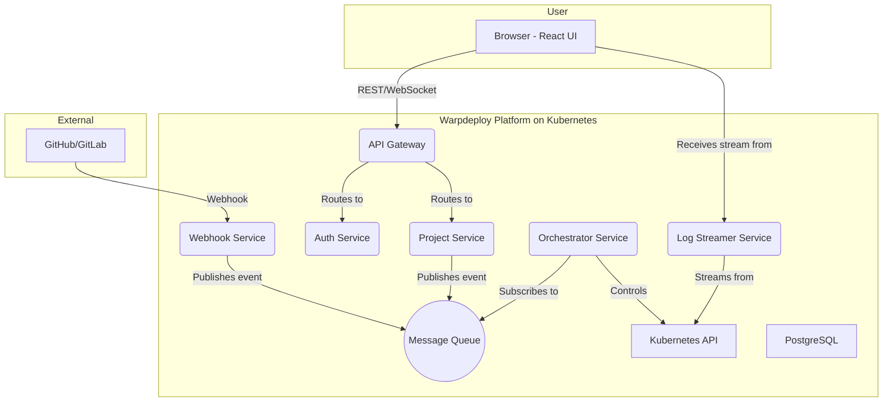

 

-----

# 🚀 Warpdeploy: Your Personal Git-to-Live PaaS (DEMO) 

  

[](https://github.com)
[](https://opensource.org/licenses/MIT)

**Warpdeploy** là một nền tảng Platform as a Service (PaaS) mã nguồn mở, cho phép bạn triển khai ứng dụng từ mã nguồn Git lên Kubernetes một cách hoàn toàn tự động. Dự án này là một minh chứng thực tế về việc xây dựng một hệ thống cloud-native phức tạp dựa trên kiến trúc microservices.

Mục tiêu của Warpdeploy không chỉ là tạo ra một công cụ, mà còn là một hành trình khám phá và làm chủ các công nghệ nền tảng của điện toán đám mây hiện đại.

-----

## ✨ Tính năng nổi bật (Key Features) (DEMO)

  * **Luồng làm việc Git-Driven:** Chỉ cần `git push` và Warpdeploy sẽ lo phần còn lại.
  * **Tự động Build:** Tự động phát hiện ngôn ngữ và build mã nguồn thành Docker image bằng Cloud Native Buildpacks mà không cần `Dockerfile`.
  * **Triển khai trên Kubernetes:** Tự động hóa việc tạo `Deployment`, `Service`, và `Ingress` để đưa ứng dụng của bạn ra thế giới.
  * **Kiến trúc Microservices:** Toàn bộ nền tảng được xây dựng từ các dịch vụ nhỏ, độc lập, có khả năng mở rộng cao.
  * **Log thời gian thực:** Theo dõi log build và log ứng dụng trực tiếp từ giao diện web.
  * **Giao diện trực quan:** Bảng điều khiển (Dashboard) được xây dựng bằng React để quản lý và giám sát các dự án của bạn.

-----

## 🏛️ Kiến trúc (Architecture) (DEMO)

Warpdeploy được xây dựng trên kiến trúc microservices để đảm bảo tính linh hoạt, khả năng mở rộng và dễ bảo trì. Các dịch vụ giao tiếp với nhau một cách bất đồng bộ thông qua một Message Queue (RabbitMQ).



### **Các Microservices chính:** 

  * **API Gateway:** Cổng vào duy nhất, chịu trách nhiệm định tuyến, xác thực và rate limiting.
  * **Auth Service:** Xử lý xác thực OAuth2 với Git providers và quản lý JWT.
  * **Project Service:** Quản lý metadata của các dự án (repo URL, biến môi trường, trạng thái).
  * **Orchestrator Service:** "Trái tim" của hệ thống, lắng nghe các sự kiện và thực hiện quy trình build/deploy bằng cách giao tiếp với Kubernetes API.
  * **Webhook Service:** Lắng nghe các sự kiện `git push` và đẩy chúng vào message queue.
  * **Log Streamer Service:** Stream log từ Kubernetes về giao diện người dùng qua WebSockets.

-----

## 🛠️ Công nghệ sử dụng (Tech Stack)  (DEMO)

  * **Frontend:** React, TypeScript, Tailwind CSS
  * **Backend (Microservices):** Node.js, Express.js (có thể thay thế một số service bằng Go/Rust để tối ưu hiệu năng)
  * **Hạ tầng:** Docker, Kubernetes
  * **Giao tiếp:** RabbitMQ (Message Queue), WebSockets
  * **Cơ sở dữ liệu:** PostgreSQL
  * **CI/CD:** GitHub Actions

-----

## 🚀 Bắt đầu (Getting Started) (DEMO)

### Yêu cầu (Prerequisites)

  * Node.js v18+
  * Docker
  * Một cluster Kubernetes (có thể dùng `minikube` hoặc `k3d` cho môi trường local)
  * `kubectl` command-line tool

### Cài đặt (Installation) (DEMO)

1.  **Clone a repo:**

    ```bash
    git clone https://github.com/your-username/Warpdeploy.git
    cd Warpdeploy
    ```

2.  **Cấu hình môi trường:**

      * Sao chép file `.env.example` thành `.env` và điền các thông tin cần thiết (JWT secret, GitHub OAuth credentials, ...).

3.  **Triển khai hạ tầng:**

      * Triển khai RabbitMQ và PostgreSQL lên cluster của bạn.
      * ```bash
          # Ví dụ với Helm
          helm install rabbitmq bitnami/rabbitmq
          helm install postgresql bitnami/postgresql
        ```

4.  **Triển khai các dịch vụ Warpdeploy:**

      * Áp dụng tất cả các file cấu hình Kubernetes trong thư mục `k8s/`.
      * ```bash
          kubectl apply -f k8s/
        ```

-----

## 📖 Hướng dẫn sử dụng (Usage) (DEMO)

1.  Truy cập giao diện Warpdeploy tại địa chỉ được Ingress cung cấp.
2.  Đăng nhập bằng tài khoản GitHub của bạn.
3.  Chọn "New Project" và chọn một repository bạn muốn triển khai.
4.  (Tùy chọn) Thêm các biến môi trường cần thiết.
5.  Nhấn **"Deploy"** và theo dõi quá trình build & deploy trong tab "Logs".
6.  Sau vài phút, ứng dụng của bạn sẽ được cung cấp một URL công khai.

-----

## 🗺️ Lộ trình phát triển (Roadmap)  (DEMO)

  * [ ] Hỗ trợ nhiều Git providers hơn (GitLab, Bitbucket).
  * [ ] Cung cấp database (PostgreSQL, Redis) dưới dạng Add-on cho ứng dụng người dùng.
  * [ ] Bảng điều khiển giám sát tài nguyên (CPU, Memory).
  * [ ] Template dự án (Project Templates).
  * [ ] Hỗ trợ tên miền tùy chỉnh (Custom Domains).

-----

## 🙌 Đóng góp (Contributing) (DEMO)

Chúng tôi hoan nghênh mọi sự đóng góp\! Vui lòng đọc file `CONTRIBUTING.md` để biết thêm chi tiết về quy trình gửi Pull Request.

-----

## 📄 Giấy phép (License)  (DEMO)

Dự án này được cấp phép dưới Giấy phép MIT. Xem file [LICENSE](https://www.google.com/search?q=LICENSE) để biết thêm chi tiết.

-----
### Đây chỉ là bản README DEMO có thể chỉnh sửa nhiều thứ trong phần này trong tương lai