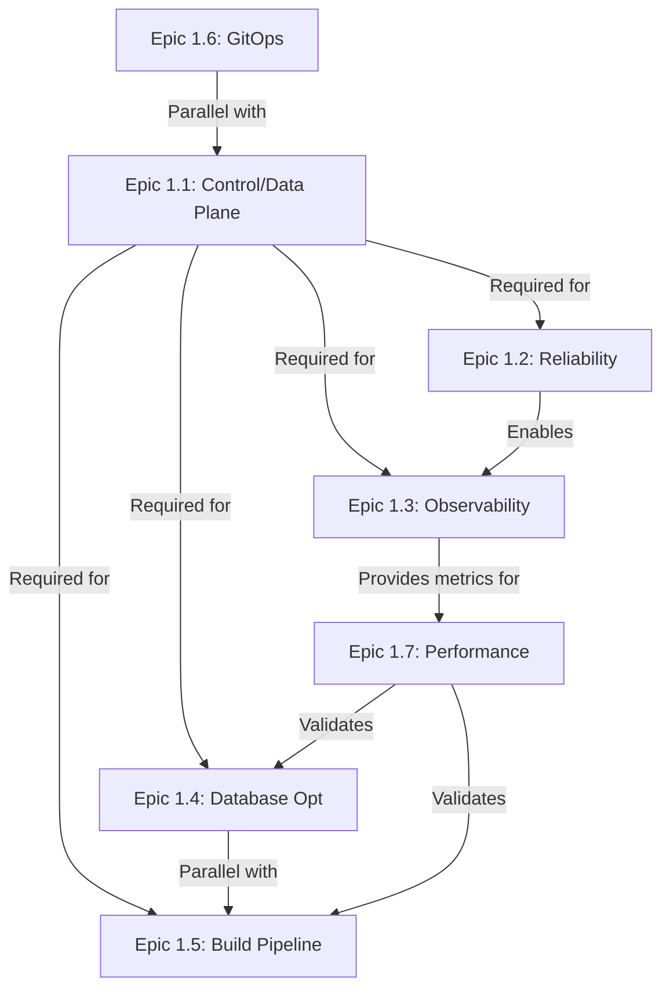
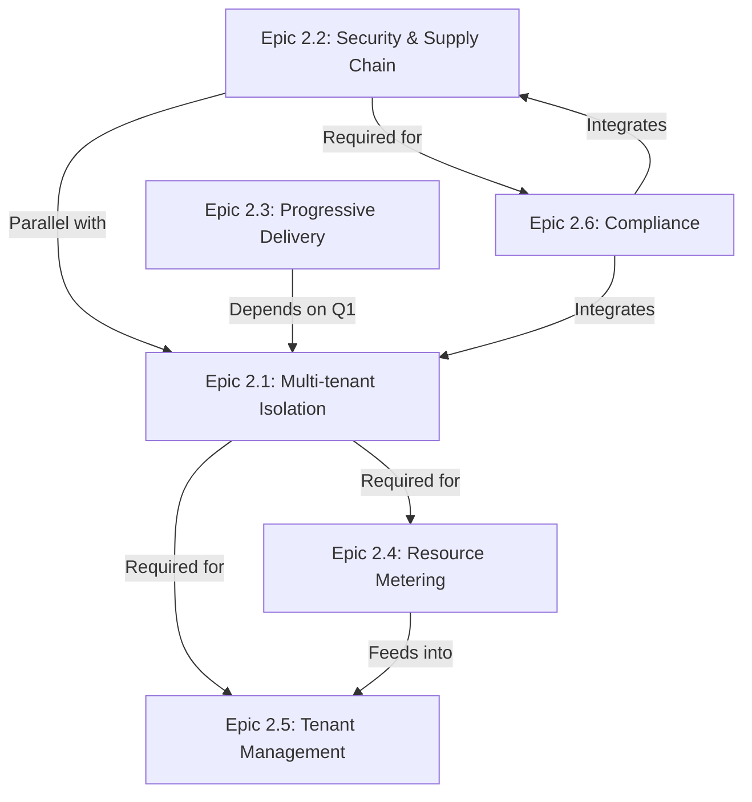
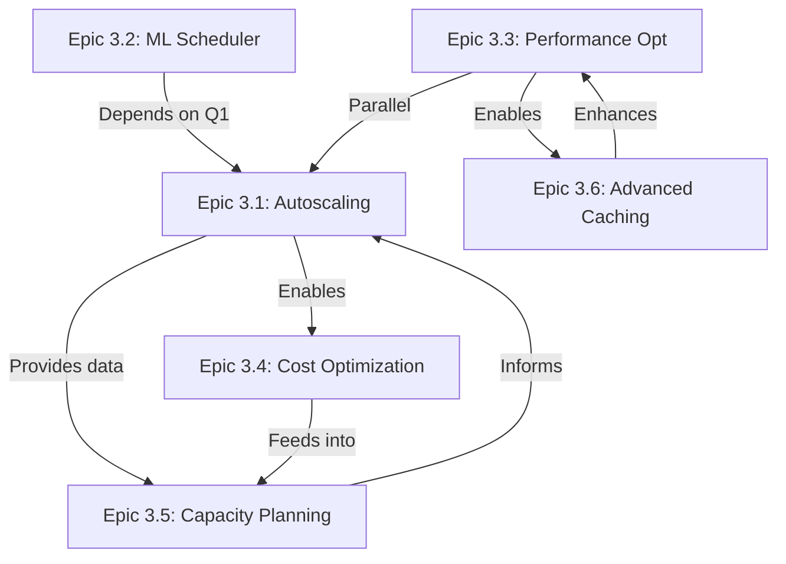
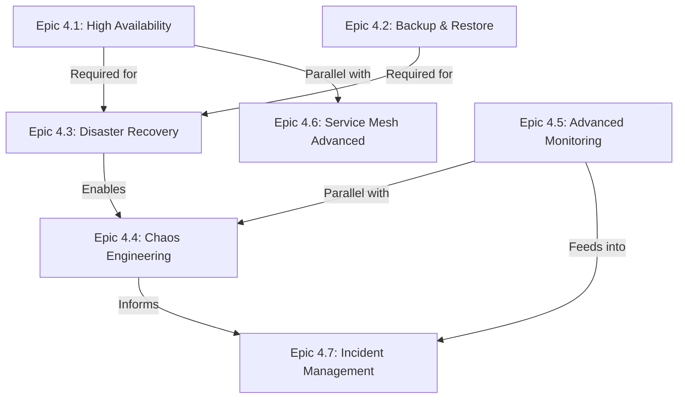

# � Lộ trình Kỹ thuật - Hệ thống Quản lý Services (Service Management Platform)
## Technical Roadmap 2025-2026 (12 tháng)

> **Mục tiêu:** Xây dựng hệ thống mạnh mẽ, có khả năng mở rộng cao để triển khai và quản lý services của khách hàng trên Kubernetes cluster. Tập trung vào **hiệu năng, độ tin cậy, tối ưu hóa và khả năng vận hành**.

---

## 📋 Mục lục
- [Kiến trúc & Phạm vi](#kiến-trúc--phạm-vi)
- [Quý 1 (Tháng 0-3): Core Infrastructure & Foundation](#quý-1-tháng-0-3-core-infrastructure--foundation)
- [Quý 2 (Tháng 4-6): Multi-tenant & Security](#quý-2-tháng-4-6-multi-tenant--security)
- [Quý 3 (Tháng 7-9): Optimization & Scalability](#quý-3-tháng-7-9-optimization--scalability)
- [Quý 4 (Tháng 10-12): Advanced Features & Resilience](#quý-4-tháng-10-12-advanced-features--resilience)
- [KPIs Tổng quan](#kpis-tổng-quan)

---

## �️ Kiến trúc & Phạm vi

### Core Platform (Giữ nguyên)
- ✅ Microservices: API Gateway, Orchestrator, Project Service, Webhook Service, Log Streamer
- ✅ Message Queue: RabbitMQ
- ✅ Database: PostgreSQL
- ✅ Build Pipeline: Cloud Native Buildpacks

### Mở rộng (Technical Focus)
- 🔧 Control Plane / Data Plane separation
- 🔧 Multi-tenant isolation với Kubernetes namespaces
- 🔧 Observability stack (OpenTelemetry, Prometheus, Grafana, Loki, Tempo)
- 🔧 Progressive Delivery (Canary, Blue/Green)
- 🔧 Autoscaling & ML-based scheduler
- 🔧 High Availability & Disaster Recovery
- 🔧 Security hardening (image scanning, SBOM, signing)
- 🔧 Performance optimization (caching, batching, resource pooling)

---

## 📅 QUÝ 1 (Tháng 0-3): Core Infrastructure & Foundation

### 🎯 Mục tiêu Chiến lược

**Xây dựng nền tảng vững chắc cho toàn bộ hệ thống**: Thiết lập kiến trúc phân tách Control Plane/Data Plane, đảm bảo độ tin cậy cao (reliability & resilience), triển khai observability stack đầy đủ, và tối ưu hóa các thành phần cốt lõi (database, build pipeline). Đây là giai đoạn quan trọng nhất, đặt nền móng cho các quý tiếp theo.

### 📐 Nguyên tắc Kỹ thuật

- **Scalability First:** Mọi thiết kế phải hỗ trợ horizontal scaling từ đầu
- **Observability by Default:** Tất cả services phải có traces, metrics, logs đầy đủ
- **Fail-Safe Design:** Implement circuit breakers, retries, idempotency cho mọi critical operations
- **Infrastructure as Code:** Toàn bộ infrastructure phải được quản lý bằng code (GitOps)
- **Performance Baseline:** Thiết lập baseline metrics ngay từ đầu để đo lường cải tiến

### 📊 Timeline Tổng Quan

```
Tuần 1-4:   Epic 1.1 (Control/Data Plane) + 1.6 (GitOps Foundation)
Tuần 3-6:   Epic 1.2 (Reliability & Resilience)
Tuần 5-10:  Epic 1.3 (Observability Stack) + 1.7 (Performance Baseline)
Tuần 8-12:  Epic 1.4 (Database Optimization) + 1.5 (Build Pipeline)
```

---

### Epic 1.1: Control Plane / Data Plane Separation
**Timeline:** Tuần 1-4 | **Priority:** P0 (Critical) | **Owner:** Platform Team

#### 📋 Mô tả
Tách biệt Control Plane (logic điều phối, quản lý) và Data Plane (thực thi triển khai thực tế) để đạt được khả năng scale độc lập, cô lập lỗi, và giảm blast radius khi có sự cố. Control Plane sẽ chịu trách nhiệm về API, scheduling, state management, trong khi Data Plane agents chạy trên các cluster thực hiện deployment commands.

#### 🎯 Phạm vi
- Refactor Orchestrator Service thành Control Plane service độc lập
- Implement Data Plane agents (lightweight) cho mỗi managed cluster
- Migrate từ HTTP sang gRPC cho internal communication
- Centralized state management với PostgreSQL và distributed locking

#### 📦 Deliverables

**1. Control Plane Service Refactoring**
- **Chức năng:**
  - REST API public endpoints (authentication, authorization)
  - gRPC server cho internal communication với Data Plane
  - Scheduling engine (workload placement, resource allocation)
  - State management interface (PostgreSQL + Redis)
  - Event bus integration (RabbitMQ publisher)
- **Tech Stack:** Node.js 20+, TypeScript 5+, Express.js/Fastify, gRPC-node
- **Deliverables:**
  - `control-plane-service/` codebase với clean architecture
  - API documentation (OpenAPI 3.0 spec)
  - gRPC protobuf definitions (`.proto` files)
  - Docker image với multi-stage build
  - Kubernetes manifests (Deployment, Service, ConfigMap, Secrets)

**2. Data Plane Agent Implementation**
- **Chức năng:**
  - gRPC client kết nối tới Control Plane
  - Kubernetes client (deployment, service, configmap operations)
  - Local state cache (reduce API calls)
  - Metrics reporter (push to Control Plane)
  - Health check endpoint
- **Tech Stack:** Node.js 20+, TypeScript, gRPC, @kubernetes/client-node
- **Deliverables:**
  - `data-plane-agent/` codebase
  - DaemonSet/Deployment manifests
  - Agent configuration schema
  - Connection pooling & retry logic
  - Agent CLI for debugging

**3. gRPC Communication Layer**
- **Chức năng:**
  - Protocol buffers cho tất cả service contracts
  - Bi-directional streaming support (logs, metrics)
  - Connection pooling và load balancing
  - TLS/mTLS support cho security
  - Request/response interceptors (logging, auth, rate limiting)
- **Deliverables:**
  - `.proto` files cho: DeploymentService, LogService, MetricsService, HealthService
  - Generated TypeScript types
  - gRPC middleware library
  - Connection pool configuration
  - Load testing results (comparison vs HTTP)

**4. Centralized State Management**
- **Chức năng:**
  - PostgreSQL schema cho deployment states, tasks, locks
  - Optimistic locking pattern (version-based)
  - Event sourcing table (audit trail)
  - Database migration system (TypeORM/Prisma migrations)
  - State consistency validation
- **Deliverables:**
  - Database schema migrations
  - State management service layer
  - Repository pattern implementation
  - Transaction management utilities
  - State reconciliation job (detect drift)

#### ✅ Success Criteria (KPIs)

| Metric | Target | Measurement | Rationale |
|--------|--------|-------------|-----------|
| Control Plane API latency (p95) | < 100ms | Prometheus histogram | User-facing responsiveness |
| gRPC latency reduction vs HTTP | ≥ 40% | A/B testing | Justify migration cost |
| Zero downtime deployment | 100% | Rolling update test | Production reliability |
| Data Plane independent scaling | 1-10 clusters | Load test | Multi-cluster support |
| Connection pool reuse rate | ≥ 90% | gRPC metrics | Resource efficiency |
| State consistency | 100% | Integration test suite | Data integrity |
| Database query latency (p95) | < 50ms | pg_stat_statements | Backend performance |
| Concurrent deployment support | ≥ 1000 | Load test | Scalability proof |

#### ⚠️ Risks & Mitigation

| Risk | Impact | Probability | Mitigation |
|------|--------|-------------|------------|
| gRPC migration phá vỡ existing clients | High | Medium | Phased rollout, dual HTTP/gRPC support trong transition period |
| State migration data loss | Critical | Low | Backup trước migration, rollback plan, dry-run testing |
| Data Plane agents không reconnect sau network partition | Medium | Medium | Implement exponential backoff retry, connection health check |
| Performance regression sau refactoring | High | Medium | Establish baseline trước khi refactor, continuous benchmarking |

---

### Epic 1.2: Reliability & Resilience Patterns
**Timeline:** Tuần 3-6 | **Priority:** P0 (Critical) | **Owner:** Platform Team

#### 📋 Mô tả
Implement các design patterns thiết yếu để đảm bảo hệ thống hoạt động ổn định trong môi trường distributed system: idempotency (tránh duplicate operations), circuit breakers (cô lập lỗi), dead letter queues (xử lý failed messages), và health checks toàn diện.

#### 🎯 Phạm vi
- Idempotency middleware cho tất cả mutating operations
- Circuit breaker pattern cho external dependencies
- Dead Letter Queue configuration và monitoring
- Comprehensive health checks cho K8s probes

#### 📦 Deliverables

**1. Idempotency Keys System**
- **Chức năng:**
  - Middleware tự động generate idempotency keys (SHA256 hash của request body + timestamp)
  - Redis-backed deduplication cache (TTL 24h)
  - Automatic retry với exponential backoff + jitter
  - Idempotency key API header (`Idempotency-Key`)
- **Deliverables:**
  - Express.js/Fastify middleware package
  - Redis Lua scripts cho atomic operations
  - Configuration schema (TTL, max retries, backoff multiplier)
  - Integration tests với concurrent requests
  - Documentation và usage examples

**2. Circuit Breaker Implementation**
- **Chức năng:**
  - Circuit breaker cho K8s API, Git providers, Container Registry, External APIs
  - Configurable thresholds: failure rate (%), timeout (ms), half-open state duration
  - State transitions: CLOSED → OPEN → HALF_OPEN → CLOSED
  - Fallback strategies: cached data, default values, graceful degradation
  - Metrics export (state changes, failure counts, success rate)
- **Tech Stack:** Opossum (Node.js circuit breaker library)
- **Deliverables:**
  - Circuit breaker wrapper library
  - Configuration per external service
  - Fallback strategy implementations
  - Circuit breaker dashboard (Grafana)
  - Chaos testing scenarios

**3. Dead Letter Queue (DLQ) Setup**
- **Chức năng:**
  - DLQ cho tất cả RabbitMQ queues
  - Automatic retry logic (3 attempts, exponential backoff: 1s, 5s, 30s)
  - Dead letter exchange và routing
  - Manual replay functionality (admin API)
  - DLQ monitoring dashboard
- **Deliverables:**
  - RabbitMQ DLQ configuration (exchanges, bindings, policies)
  - Consumer retry middleware
  - DLQ replay service (API + CLI)
  - Alert rules (DLQ size > threshold)
  - Grafana DLQ dashboard

**4. Health Checks & Probes**
- **Chức năng:**
  - `/health` endpoint: deep health check (DB, Redis, RabbitMQ, external APIs)
  - `/ready` endpoint: shallow check (service ready to serve traffic)
  - `/metrics` endpoint: Prometheus format metrics
  - Graceful shutdown handling (SIGTERM)
  - Startup probe support
- **Deliverables:**
  - Health check middleware library
  - Dependency health checker implementations
  - K8s probe configurations (liveness, readiness, startup)
  - Health check response schema
  - Load test verification (no traffic to unhealthy pods)

#### ✅ Success Criteria (KPIs)

| Metric | Target | Measurement | Rationale |
|--------|--------|-------------|-----------|
| Idempotency deduplication rate | 100% | Redis cache metrics | No duplicate operations |
| Double-deployment prevention | 0 occurrences | Chaos test (1000 concurrent retries) | Data integrity |
| Cache hit rate (idempotency) | ≥ 85% | Redis INFO stats | Cache effectiveness |
| Circuit breaker recovery time | < 30s | Circuit state metrics | Fast failure recovery |
| Failed request rate (normal ops) | < 0.1% | Prometheus error rate | System stability |
| DLQ message capture rate | 100% | RabbitMQ metrics | No message loss |
| DLQ replay success rate | ≥ 95% | Replay service logs | Recovery effectiveness |
| Health check latency | < 10ms | Endpoint response time | Non-intrusive monitoring |
| Zero traffic to unhealthy pods | 100% | Load test + K8s events | Traffic routing correctness |

#### ⚠️ Risks & Mitigation

| Risk | Impact | Probability | Mitigation |
|------|--------|-------------|------------|
| Redis cache failure → tất cả requests bị reject | Critical | Low | Fallback to stateless idempotency check (short time window) |
| Circuit breaker false positive → service unavailable | High | Medium | Tuning thresholds dựa trên historical data, manual override capability |
| DLQ infinite retry loop | Medium | Medium | Max retry limit, exponential backoff ceiling, manual intervention required |

---

### Epic 1.3: Observability Stack (Full Deployment)
**Timeline:** Tuần 5-10 | **Priority:** P0 (Critical) | **Owner:** Platform + SRE Team

#### 📋 Mô tả
Triển khai observability stack đầy đủ theo chuẩn OpenTelemetry, bao gồm metrics (Prometheus), logs (Loki), traces (Tempo), và visualization (Grafana). Đây là foundation cho monitoring, debugging, và performance optimization trong các quý tiếp theo.

#### 🎯 Phạm vi
- OpenTelemetry instrumentation cho tất cả services
- Prometheus + Grafana stack deployment
- Loki log aggregation system
- Tempo distributed tracing backend
- Pre-built dashboards và alert rules

#### 📦 Deliverables

**1. OpenTelemetry Integration**
- **Chức năng:**
  - Auto-instrumentation cho HTTP, gRPC, Database, Message Queue
  - Custom spans cho business logic (deployment, build, scaling operations)
  - Trace context propagation (W3C Trace Context standard)
  - Baggage propagation cho metadata
  - Sampling strategies: 100% errors, 10% success (configurable per environment)
- **Tech Stack:** @opentelemetry/sdk-node, @opentelemetry/auto-instrumentations-node
- **Deliverables:**
  - OpenTelemetry Collector deployment (daemonset)
  - Instrumentation library per service type
  - Trace context middleware (Express.js, gRPC)
  - Custom span utility library
  - Instrumentation documentation

**2. Prometheus + Grafana Stack**
- **Chức năng:**
  - Prometheus deployment với service discovery (K8s API)
  - ServiceMonitor CRDs cho auto-discovery
  - AlertManager integration
  - Grafana deployment với datasource provisioning
  - Pre-built dashboards: System Overview, Service Detail, SLI/SLO Tracking, RabbitMQ, PostgreSQL
  - Alert rules library (yaml-based, version controlled)
- **Deliverables:**
  - Prometheus Operator deployment
  - ServiceMonitor templates per service type
  - Grafana dashboard JSON definitions
  - Alert rules ConfigMaps
  - Recording rules (pre-aggregation)
  - Prometheus storage configuration (retention 30 days)

**3. Loki Log Aggregation**
- **Chức năng:**
  - Loki deployment (microservices mode: distributor, ingester, querier, compactor)
  - Object storage backend (S3/MinIO)
  - Promtail daemonset (log shipper)
  - Log parsing và labeling
  - Log retention policies (7 days debug, 30 days info, 90 days error/warn)
  - LogQL query library
- **Deliverables:**
  - Loki Helm chart deployment
  - Promtail configuration (scrape configs, relabeling)
  - Log parsing rules (JSON, multiline)
  - Grafana Loki datasource
  - LogQL query templates
  - Log volume dashboard

**4. Tempo Distributed Tracing**
- **Chức năng:**
  - Tempo deployment (microservices mode)
  - Object storage backend
  - Trace ingestion pipeline (OTLP protocol)
  - Trace sampling (head-based + tail-based)
  - Grafana integration (trace-to-logs correlation)
- **Deliverables:**
  - Tempo Helm chart deployment
  - OTLP receiver configuration
  - Sampling configuration
  - Grafana Tempo datasource
  - Trace query interface
  - Trace retention configuration (14 days)

**5. Custom Operational Dashboards**
- **Dashboards:**
  - **System Overview:** Node CPU/Mem/Disk, pod count, deployment frequency, error rate
  - **Service Detail:** Latency percentiles (p50/p90/p95/p99), throughput (req/s), error rate, resource usage
  - **Build Pipeline:** Build duration histogram, success rate, queue length, cache hit rate
  - **Database:** Query latency, connection pool usage, slow queries, replication lag
  - **Message Queue:** Message rate, queue depth, consumer lag, DLQ size
  - **SLI/SLO Tracking:** Availability, latency SLOs, error budget burn rate, SLO compliance
- **Deliverables:**
  - 6+ Grafana dashboards (JSON definitions)
  - Dashboard provisioning via ConfigMap
  - Variables và templating setup
  - Auto-refresh configuration (10s interval)
  - Drill-down links (dashboard → logs → traces)

#### ✅ Success Criteria (KPIs)

| Metric | Target | Measurement | Rationale |
|--------|--------|-------------|-----------|
| Trace coverage | 100% requests | Tempo query count vs API metrics | Complete observability |
| Trace sampling (errors) | 100% | Sampling config verification | No error trace loss |
| Trace sampling (success) | 10% (configurable) | Sampling metrics | Balance storage cost |
| Trace latency overhead | < 5ms | Benchmark with/without tracing | Minimal performance impact |
| Metrics scrape interval | 15s | Prometheus config | Timely data |
| Metric retention | 30 days | Prometheus storage | Historical analysis |
| Query response time (p95) | < 500ms | Grafana query timing | Dashboard responsiveness |
| Alert firing latency | < 1 minute | Alert timestamp vs trigger time | Fast incident response |
| Log ingestion rate | ≥ 10K logs/sec | Loki metrics | Handle production load |
| Log search latency (p95) | < 2s | LogQL query timing | Efficient debugging |
| Log compression ratio | ≥ 5:1 | Storage size comparison | Cost optimization |
| Trace ingestion rate | ≥ 1K traces/sec | Tempo metrics | Handle production load |
| Trace storage cost | < $100/TB/month | Cloud storage billing | Cost efficiency |
| Dashboard load time | < 1s | Browser performance timing | User experience |
| Dashboard coverage | 100% key metrics | Manual verification | Complete visibility |

#### ⚠️ Risks & Mitigation

| Risk | Impact | Probability | Mitigation |
|------|--------|-------------|------------|
| Observability stack overhead → performance degradation | High | Medium | Careful resource limits, sampling tuning, performance testing |
| Storage cost explosion (logs, traces) | Medium | High | Aggressive retention policies, compression, sampling, cost monitoring |
| Alert fatigue (too many alerts) | Medium | High | Tuned thresholds, alert grouping, on-call rotation |
| Dashboard sprawl (too many dashboards) | Low | High | Dashboard governance, templates, regular review |

---

### Epic 1.4: Database Optimization & Scaling
**Timeline:** Tuần 8-12 | **Priority:** P1 (High) | **Owner:** Backend + DBA Team

#### 📋 Mô tả
Tối ưu hóa PostgreSQL database để đáp ứng yêu cầu về hiệu năng cao và khả năng mở rộng. Bao gồm index optimization, connection pooling, và read replica setup cho read-heavy workloads.

#### 🎯 Phạm vi
- Query performance optimization (indexes, query tuning)
- Connection pooling với pgBouncer
- Read replicas cho read scaling
- Database monitoring và slow query analysis

#### 📦 Deliverables

**1. Index Optimization Strategy**
- **Phân tích:**
  - Identify slow queries từ pg_stat_statements
  - Analyze query patterns (WHERE, JOIN, ORDER BY clauses)
  - Explain plan analysis cho top 20 slowest queries
  - Index usage statistics (pg_stat_user_indexes)
- **Implementation:**
  - B-tree indexes cho foreign keys, lookup columns
  - Partial indexes cho filtered queries (e.g., `WHERE status='running'`)
  - Composite indexes cho multi-column queries
  - GIN/GiST indexes cho JSONB, full-text search
- **Deliverables:**
  - Index analysis report
  - Migration scripts (index creation)
  - Index monitoring dashboard
  - Index maintenance procedures (REINDEX schedule)

**2. Connection Pooling với pgBouncer**
- **Chức năng:**
  - pgBouncer deployment (transaction pooling mode)
  - Pool size tuning: min 10, max 100, idle timeout 30s
  - Per-user/per-database pool configuration
  - Connection metrics monitoring
- **Deliverables:**
  - pgBouncer StatefulSet deployment
  - Configuration file (pgbouncer.ini)
  - Application connection string update
  - Connection pool metrics exporter
  - Connection pool dashboard

**3. PostgreSQL Read Replicas**
- **Chức năng:**
  - 2x read replicas với streaming replication
  - Application-level read/write splitting
  - Replica lag monitoring
  - Automatic failover testing
- **Architecture:**
  - Primary (read-write): 1 instance
  - Replicas (read-only): 2 instances
  - Load balancer: pgpool-II hoặc application-level routing
- **Deliverables:**
  - PostgreSQL streaming replication setup
  - Read replica StatefulSet
  - Read/write split middleware
  - Replication lag alerts
  - Failover runbook

#### ✅ Success Criteria (KPIs)

| Metric | Target | Measurement | Rationale |
|--------|--------|-------------|-----------|
| Query time reduction | ≥ 60% (top queries) | Before/after pg_stat_statements | Performance improvement |
| Index hit ratio | ≥ 99% | pg_stat_user_indexes | Index effectiveness |
| Sequential scans (large tables) | 0 scans (> 10K rows) | pg_stat_user_tables | Query optimization |
| Connection pool saturation | < 80% | pgBouncer metrics | Sufficient capacity |
| Connection acquire time (p95) | < 5ms | Application metrics | Low latency |
| "Too many connections" errors | 0 errors | PostgreSQL logs | Connection pool works |
| Read query offload | ≥ 70% | Query routing metrics | Replica effectiveness |
| Replica lag (p95) | < 1s | Replication lag monitoring | Near real-time replication |
| Failover test success | < 10s downtime | Failover drill | HA capability |

#### ⚠️ Risks & Mitigation

| Risk | Impact | Probability | Mitigation |
|------|--------|-------------|------------|
| Index creation locking table → downtime | Medium | Medium | CREATE INDEX CONCURRENTLY, off-peak execution |
| pgBouncer single point of failure | High | Low | Deploy 2+ pgBouncer instances behind load balancer |
| Replica lag → stale reads | Medium | Medium | Monitor lag, fallback to primary if lag > threshold |

---

### Epic 1.5: Build Pipeline Optimization
**Timeline:** Tuần 9-12 | **Priority:** P1 (High) | **Owner:** DevOps Team

#### 📋 Mô tả
Tối ưu hóa build pipeline để giảm thời gian build, tăng throughput, và cải thiện developer experience. Implement multi-layer caching, parallel execution, và comprehensive monitoring.

#### 🎯 Phạm vi
- Multi-layer build caching (registry, buildpack, dependencies)
- Parallel build execution với resource isolation
- Build metrics và monitoring dashboard
- Build queue management

#### 📦 Deliverables

**1. Multi-Layer Build Cache**
- **Cache Layers:**
  - **Registry Layer:** Docker registry mirror/Harbor (image layer caching)
  - **Buildpack Cache:** Persistent volumes cho buildpack cache
  - **Dependency Cache:** npm/pip/go modules cache (shared volume hoặc registry)
- **Cache Management:**
  - Cache size monitoring (target < 500GB)
  - Automatic cache cleanup (LRU eviction)
  - Cache hit rate tracking
- **Deliverables:**
  - Harbor registry deployment (hoặc registry mirror)
  - Buildpack cache PersistentVolume configuration
  - Dependency cache setup (per language)
  - Cache metrics exporter
  - Cache dashboard

**2. Parallel Build Execution System**
- **Chức năng:**
  - Build queue với priority scheduling (P0 > P1 > P2)
  - Resource limits per build (CPU, memory, disk I/O)
  - Build isolation (separate namespaces/pods)
  - Build cancellation API
  - Build log streaming (WebSocket)
- **Deliverables:**
  - Build queue service (RabbitMQ-based)
  - Build executor pods (Kubernetes Jobs)
  - Resource quota enforcement
  - Build cancellation logic
  - Build API endpoints

**3. Build Metrics & Monitoring**
- **Metrics:**
  - Build duration histogram (per language/framework)
  - Build success rate (per repository)
  - Build queue depth (real-time)
  - Resource usage per build (CPU, memory, disk)
  - Cache hit rate (per cache type)
- **Deliverables:**
  - Build metrics exporter (Prometheus format)
  - Build analytics service
  - Build dashboard (Grafana)
  - Build failure alerts (Slack/webhook)
  - Build performance report (weekly)

#### ✅ Success Criteria (KPIs)

| Metric | Target | Measurement | Rationale |
|--------|--------|-------------|-----------|
| Cache hit rate | ≥ 70% | Build logs analysis | Cache effectiveness |
| Build time reduction | ≥ 50% (with cache) | Before/after comparison | Developer productivity |
| Cache size | < 500GB | Storage monitoring | Cost control |
| Concurrent builds supported | ≥ 10 builds | Load test | Scalability |
| Build queue latency (p95) | < 30s | Queue metrics | Fast build start |
| Build resource interference | 0 incidents | Resource monitoring | Isolation works |
| Build tracking coverage | 100% | Build logs | Complete visibility |
| Build failure alert latency | < 1 minute | Alert timestamp | Fast feedback |
| Build dashboard availability | 100% | Grafana uptime | Always accessible |

#### ⚠️ Risks & Mitigation

| Risk | Impact | Probability | Mitigation |
|------|--------|-------------|------------|
| Cache corruption → build failures | High | Low | Cache validation, automatic cache invalidation on error |
| Build resource exhaustion → cluster instability | Critical | Medium | Strict resource limits, build pod priority class, resource quotas |
| Parallel builds → cache thrashing | Medium | Medium | Cache locking, build serialization for same repo |

---

### Epic 1.6: GitOps & Infrastructure as Code Foundation
**Timeline:** Tuần 1-6 | **Priority:** P0 (Critical) | **Owner:** Platform Team

#### 📋 Mô tả
Thiết lập GitOps workflow và Infrastructure as Code (IaC) foundation để đảm bảo mọi thay đổi infrastructure đều được version control, review, và tự động deploy. Đây là best practice thiết yếu cho production-grade platform.

#### 🎯 Phạm vi
- ArgoCD/Flux CD setup cho continuous deployment
- Infrastructure as Code (Terraform/Pulumi) cho cloud resources
- Git repository structure và branching strategy
- Drift detection và automatic reconciliation

#### 📦 Deliverables

**1. GitOps Controller Setup**
- **Chức năng:**
  - ArgoCD hoặc Flux CD deployment
  - Git repository sync (auto-sync enabled)
  - Application CRDs cho mọi service
  - Sync waves (deployment ordering)
  - Health checks và sync status
- **Tech Stack:** ArgoCD 2.9+ hoặc Flux CD 2.1+
- **Deliverables:**
  - GitOps controller deployment (HA setup)
  - Application manifest repository structure
  - Sync policy configuration
  - GitOps dashboard access
  - SSO integration (GitHub/GitLab OAuth)

**2. Infrastructure as Code (IaC)**
- **Scope:**
  - Kubernetes cluster provisioning (EKS/GKE/AKS)
  - Networking (VPC, subnets, security groups)
  - Storage (S3/GCS buckets, EBS/PD volumes)
  - IAM roles và policies
  - DNS records (Route53/Cloud DNS)
- **Tech Stack:** Terraform 1.6+ hoặc Pulumi 3.0+
- **Deliverables:**
  - IaC modules (reusable)
  - Environment-specific configurations (dev, staging, prod)
  - State management (Terraform Cloud/S3 backend)
  - CI/CD pipeline cho IaC (plan → review → apply)
  - IaC documentation

**3. Git Repository Structure**
- **Structure:**
  ```
  infrastructure/
    terraform/         # IaC code
    k8s/
      base/            # Kustomize base
      overlays/
        dev/
        staging/
        prod/
    argocd/            # ArgoCD Application CRDs
  services/
    api-gateway/
    orchestrator/
    ...
  ```
- **Branching Strategy:**
  - `main` branch → production
  - `staging` branch → staging environment
  - Feature branches → PR workflow
- **Deliverables:**
  - Repository structure documentation
  - Branch protection rules
  - PR templates
  - CODEOWNERS file

**4. Drift Detection & Reconciliation**
- **Chức năng:**
  - Automatic drift detection (Git vs Cluster state)
  - Alert on drift detected
  - Automatic reconciliation (configurable)
  - Manual approval workflow cho critical changes
- **Deliverables:**
  - Drift detection alerts (Slack/email)
  - Reconciliation dashboard
  - Drift reports (daily)
  - Manual sync UI

#### ✅ Success Criteria (KPIs)

| Metric | Target | Measurement | Rationale |
|--------|--------|-------------|-----------|
| GitOps sync success rate | ≥ 99% | ArgoCD/Flux metrics | Reliable automation |
| Sync latency | < 2 minutes | Git commit → deployed | Fast deployment |
| Drift detection rate | 100% | Drift monitoring | Complete visibility |
| Manual changes in cluster | 0 changes | Audit logs | GitOps enforcement |
| IaC coverage | 100% infrastructure | Manual audit | Everything as code |
| IaC apply success rate | ≥ 98% | CI/CD metrics | Reliable IaC |
| Code review coverage | 100% changes | GitHub PR stats | Quality assurance |

#### ⚠️ Risks & Mitigation

| Risk | Impact | Probability | Mitigation |
|------|--------|-------------|------------|
| Auto-sync causing production outage | Critical | Low | Staged rollout (dev → staging → prod), manual approval for prod |
| Git repository compromise | Critical | Low | Branch protection, required reviews, audit logs |
| IaC state file corruption | High | Low | State file backup, state locking, versioned backend |

---

### Epic 1.7: Performance Baseline & Load Testing
**Timeline:** Tuần 8-12 | **Priority:** P1 (High) | **Owner:** SRE + QA Team

#### 📋 Mô tả
Thiết lập performance baseline và load testing framework để đo lường hiệu năng hệ thống, xác định bottlenecks, và validate capacity planning. Baseline này là reference cho tất cả optimization efforts trong các quý tiếp theo.

#### 🎯 Phạm vi
- Load testing framework setup (k6, Locust, hoặc Gatling)
- Performance baseline establishment (latency, throughput, error rate)
- Capacity testing (max concurrent users, requests/sec)
- Performance regression detection

#### 📦 Deliverables

**1. Load Testing Framework**
- **Chức năng:**
  - Load testing scripts cho critical APIs
  - Test scenarios: normal load, peak load, stress test, spike test
  - Distributed load generation (multiple load generators)
  - Real-time metrics collection
- **Tech Stack:** k6 (recommended) hoặc Locust
- **Deliverables:**
  - Load testing scripts repository
  - Test scenario definitions
  - Load generator deployment (K8s Jobs)
  - Test execution CLI
  - Test report generator

**2. Performance Baseline Establishment**
- **Metrics:**
  - **Latency:** API response time (p50, p90, p95, p99)
  - **Throughput:** Requests/second per endpoint
  - **Error Rate:** 4xx/5xx errors percentage
  - **Resource Usage:** CPU, memory, disk I/O per service
  - **Database:** Query latency, connection count
  - **Message Queue:** Message rate, queue depth
- **Test Conditions:**
  - Normal load: 100 req/s
  - Peak load: 500 req/s
  - Stress test: 1000 req/s (until failure)
- **Deliverables:**
  - Baseline report (JSON/PDF)
  - Baseline dashboard (Grafana)
  - Baseline metrics storage (Prometheus long-term)
  - Capacity planning recommendations

**3. Automated Performance Testing**
- **Chức năng:**
  - Nightly performance test execution
  - Performance regression detection (compare vs baseline)
  - Automatic alerts on regression (>10% degradation)
  - Performance trend analysis
- **Deliverables:**
  - CI/CD pipeline integration
  - Regression detection algorithm
  - Performance test reports (automated)
  - Slack/email notifications

**4. Chaos Engineering Preparation**
- **Chức năng:**
  - Basic chaos scenarios: pod kill, network delay, CPU stress
  - Chaos testing framework setup (Chaos Mesh hoặc Litmus)
  - Blast radius measurement
  - Recovery time measurement
- **Deliverables:**
  - Chaos Mesh installation
  - Basic chaos experiments (3-5 scenarios)
  - Chaos test results
  - Resilience score calculation

#### ✅ Success Criteria (KPIs)

| Metric | Target | Measurement | Rationale |
|--------|--------|-------------|-----------|
| Baseline establishment | 100% critical APIs | Test execution logs | Complete coverage |
| Load test execution frequency | Daily (automated) | CI/CD runs | Continuous validation |
| Performance regression detection | < 10% false positive | Regression alerts accuracy | Reliable detection |
| Test report generation time | < 5 minutes | Report generation logs | Fast feedback |
| Chaos test survival rate | ≥ 80% | Chaos experiment results | Resilience validation |
| Recovery time measurement | < 5 minutes | Chaos test timing | Fast recovery |

#### ⚠️ Risks & Mitigation

| Risk | Impact | Probability | Mitigation |
|------|--------|-------------|------------|
| Load testing impacting production | Critical | Low | Separate test environment, rate limiting, kill switch |
| Chaos testing causing actual outage | High | Medium | Staged rollout, automated rollback, blast radius limits |
| False positive regression alerts | Medium | High | Baseline calibration, statistical significance testing |

---

### 📊 KPIs Quý 1 (Tổng hợp & Mở rộng)

#### Core Infrastructure Metrics

| Category | Metric | Target | Measurement Method | Priority |
|----------|--------|--------|-------------------|----------|
| **Control Plane** | API latency (p95) | < 100ms | Prometheus histogram | P0 |
| | API availability | ≥ 99.5% | Uptime monitoring | P0 |
| | gRPC latency improvement | ≥ 40% vs HTTP | Benchmark comparison | P0 |
| | Zero downtime deployment | 100% success | Rolling update tests | P0 |
| **Data Plane** | Deployment latency (p95) | < 5min | End-to-end trace | P0 |
| | Multi-cluster scaling | 1-10 clusters | Load test | P0 |
| | Agent reconnection time | < 30s | Connection metrics | P1 |
| **State Management** | Database query time (p95) | < 50ms | pg_stat_statements | P0 |
| | State consistency | 100% | Integration test suite | P0 |
| | Concurrent deployments | ≥ 1000 | Load test | P0 |
| | Connection pool saturation | < 80% | pgBouncer metrics | P1 |

#### Reliability & Resilience Metrics

| Category | Metric | Target | Measurement Method | Priority |
|----------|--------|--------|-------------------|----------|
| **Idempotency** | Deduplication rate | 100% | Redis cache metrics | P0 |
| | Double-deployment prevention | 0 occurrences | Chaos test results | P0 |
| | Cache hit rate | ≥ 85% | Redis INFO stats | P1 |
| **Circuit Breaker** | Cascading failure prevention | 0 incidents | Circuit breaker metrics | P0 |
| | Recovery time | < 30s | State transition timing | P0 |
| | Failed request rate (normal) | < 0.1% | Prometheus error rate | P0 |
| **DLQ** | Message capture rate | 100% | RabbitMQ metrics | P0 |
| | Replay success rate | ≥ 95% | Replay service logs | P1 |
| | DLQ alert trigger | > 100 messages | Alert configuration | P1 |
| **Health Checks** | Health check latency | < 10ms | Endpoint response time | P1 |
| | Traffic to unhealthy pods | 0 requests | Load test verification | P0 |

#### Observability Metrics

| Category | Metric | Target | Measurement Method | Priority |
|----------|--------|--------|-------------------|----------|
| **Tracing** | Trace coverage | 100% requests | Tempo query count | P0 |
| | Error trace sampling | 100% | Sampling config | P0 |
| | Success trace sampling | 10% (configurable) | Sampling metrics | P1 |
| | Trace latency overhead | < 5ms | Benchmark test | P1 |
| **Metrics** | Scrape interval | 15s | Prometheus config | P0 |
| | Metric retention | 30 days | Storage config | P0 |
| | Query response time (p95) | < 500ms | Grafana query timing | P1 |
| | Alert firing latency | < 1 minute | Alert timestamp delta | P0 |
| **Logs** | Ingestion rate | ≥ 10K logs/sec | Loki metrics | P0 |
| | Search latency (p95) | < 2s | LogQL query timing | P1 |
| | Compression ratio | ≥ 5:1 | Storage size comparison | P1 |
| **Dashboards** | Dashboard load time | < 1s | Browser timing | P1 |
| | Metrics coverage | 100% key metrics | Manual verification | P0 |

#### Database & Build Pipeline Metrics

| Category | Metric | Target | Measurement Method | Priority |
|----------|--------|--------|-------------------|----------|
| **Database** | Query time reduction | ≥ 60% | Before/after comparison | P1 |
| | Index hit ratio | ≥ 99% | pg_stat_user_indexes | P1 |
| | Read query offload | ≥ 70% | Query routing metrics | P1 |
| | Replica lag (p95) | < 1s | Replication monitoring | P1 |
| **Build Pipeline** | Cache hit rate | ≥ 70% | Build logs analysis | P1 |
| | Build time reduction | ≥ 50% (with cache) | Before/after comparison | P1 |
| | Concurrent builds | ≥ 10 builds | Load test | P1 |
| | Build queue latency (p95) | < 30s | Queue metrics | P1 |
| | Build failure alert latency | < 1 minute | Alert timestamp | P1 |

#### GitOps & Performance Metrics

| Category | Metric | Target | Measurement Method | Priority |
|----------|--------|--------|-------------------|----------|
| **GitOps** | Sync success rate | ≥ 99% | ArgoCD/Flux metrics | P0 |
| | Sync latency | < 2 minutes | Git commit to deployed | P0 |
| | Drift detection rate | 100% | Drift monitoring | P0 |
| | Manual cluster changes | 0 changes | Audit logs | P0 |
| | IaC coverage | 100% infrastructure | Manual audit | P1 |
| **Performance** | Baseline establishment | 100% critical APIs | Test coverage | P1 |
| | Load test frequency | Daily (automated) | CI/CD runs | P1 |
| | Performance regression detection | < 10% false positive | Alert accuracy | P1 |
| | Chaos test survival rate | ≥ 80% | Chaos experiment results | P1 |

#### Overall System Health

| Metric | Target | Measurement Method | Priority |
|--------|--------|-------------------|----------|
| System uptime | ≥ 99.5% | Uptime monitoring | P0 |
| Failed deployment rate | < 1% | Deployment success counter | P0 |
| Mean Time To Recovery (MTTR) | < 60 minutes | Incident tracking | P0 |
| Mean Time Between Failures (MTBF) | > 360 hours (15 days) | Incident logs | P0 |
| Change failure rate | < 10% | Deployment tracking | P1 |
| Deployment frequency | ≥ 10/day (per service) | CD pipeline metrics | P1 |

---

### 📝 Epic Dependencies & Critical Path



**Critical Path:** Epic 1.1 → Epic 1.2 → Epic 1.3 → Epic 1.7

**Parallel Tracks:**
- Track 1: Epic 1.1 + 1.6 (tuần 1-6)
- Track 2: Epic 1.4 + 1.5 (tuần 8-12)
- Track 3: Epic 1.7 (tuần 8-12, depends on 1.3)

---

### 🎓 Key Learnings & Best Practices

1. **Start with Observability:** Deploy observability stack sớm để có visibility ngay từ đầu
2. **GitOps from Day 1:** Mọi thay đổi phải qua Git để có audit trail đầy đủ
3. **Establish Baseline Early:** Performance baseline là reference cho mọi optimization
4. **Idempotency is Critical:** Implement idempotency trước khi scale để tránh duplicate operations
5. **Circuit Breakers Save Lives:** Protect từng dependency bằng circuit breaker
6. **Database is Often the Bottleneck:** Optimize database sớm để tránh bottleneck sau này
7. **Cache Everything (Smartly):** Build cache, API cache, database query cache - nhưng có invalidation strategy rõ ràng

---

## 📅 QUÝ 2 (Tháng 4-6): Multi-tenant Isolation & Security Hardening

### 🎯 Mục tiêu Chiến lược

**Xây dựng nền tảng bảo mật và multi-tenancy hoàn chỉnh**: Triển khai namespace isolation mạnh mẽ, hardening security pipeline với image scanning/signing/SBOM, secrets management tập trung, và progressive delivery strategies. Quý này đặt nền móng cho môi trường production-ready với security-first mindset.

### 📐 Nguyên tắc Bảo mật

- **Zero Trust Architecture:** Không tin tưởng mặc định, verify tất cả requests
- **Defense in Depth:** Nhiều lớp bảo vệ (network, admission, runtime)
- **Least Privilege:** Tối thiểu hóa permissions và access
- **Supply Chain Security:** Verify nguồn gốc và integrity của tất cả artifacts
- **Compliance by Default:** Tự động enforce security policies và audit

### 📊 Timeline Tổng Quan

```
Tuần 13-18: Epic 2.1 (Multi-tenant Isolation) + 2.5 (Tenant Management)
Tuần 15-22: Epic 2.2 (Security & Supply Chain)
Tuần 19-24: Epic 2.3 (Progressive Delivery) + 2.4 (Resource Metering)
Tuần 22-26: Epic 2.6 (Compliance & Audit)
```

---

### Epic 2.1: Multi-tenant Namespace Isolation
**Timeline:** Tuần 13-18 | **Priority:** P0 (Critical) | **Owner:** Platform + Security Team

#### 📋 Mô tả
Xây dựng hệ thống multi-tenant isolation mạnh mẽ với namespace-level separation, network policies, resource quotas, và pod security standards. Đảm bảo tenant data và workloads hoàn toàn isolated, không thể cross-contaminate.

#### 🎯 Phạm vi
- Automatic namespace provisioning với security policies
- Network isolation (NetworkPolicy)
- Resource quota enforcement (soft/hard limits)
- Pod Security Standards (restricted profile)

#### 📦 Deliverables

**1. Namespace Provisioning System**
- **Chức năng:**
  - Auto-provisioning namespace khi tenant đăng ký
  - Template-based configuration (labels, annotations, policies)
  - Automatic injection: NetworkPolicy, ResourceQuota, LimitRange, PodSecurityStandards
  - Tenant tiering system (small/medium/large/enterprise)
  - Namespace lifecycle management (create, update, archive, delete)
- **Tech Stack:** Kubernetes Admission Controller, Custom CRD
- **Deliverables:**
  - Namespace provisioner service
  - Tenant CRD definition
  - Namespace templates (Helm charts)
  - Provisioning API (POST /tenants)
  - Tenant onboarding dashboard

**2. NetworkPolicy Templates**
- **Chức năng:**
  - Default deny-all ingress/egress
  - Allowlist-based policies (whitelist approach)
  - Policy templates: web-tier, app-tier, data-tier
  - Custom policy support per tenant
  - Policy validation và testing
- **Deliverables:**
  - NetworkPolicy library (yaml templates)
  - Policy generator service
  - Cilium/Calico integration
  - Network probe testing framework
  - Policy visualization dashboard (Hubble UI)

**3. ResourceQuota Enforcement**
- **Chức năng:**
  - Real-time quota monitoring
  - Soft limits (warning alerts at 80%)
  - Hard limits (prevent over-quota deployments)
  - Quota increase request workflow
  - Historical usage tracking
- **Deliverables:**
  - Quota controller service
  - Quota API (GET/PATCH /quotas/:tenantId)
  - Admission webhook (block over-quota)
  - Quota metrics exporter
  - Quota dashboard (Grafana)

**4. Pod Security Standards (PSS)**
- **Chức năng:**
  - Enforce restricted profile (baseline + restricted)
  - No privileged containers
  - No host network/PID/IPC
  - Read-only root filesystem
  - Drop all capabilities
  - Non-root user enforcement
- **Deliverables:**
  - PodSecurity admission configuration
  - Security context templates
  - PSS validation webhook
  - Compliance report generator
  - Security violations dashboard

#### ✅ Success Criteria (KPIs)

| Metric | Target | Measurement | Rationale |
|--------|--------|-------------|-----------|
| Namespace creation time | < 5s | API response time | Fast tenant onboarding |
| NetworkPolicy coverage | 100% pods | K8s API query | Complete network isolation |
| Cross-namespace traffic | 0 connections | Network probe tests | Perfect isolation |
| Policy evaluation latency | < 1ms | Cilium metrics | No performance impact |
| Quota enforcement latency | < 1s | Admission webhook timing | Real-time enforcement |
| Over-quota deployments | 0 occurrences | Admission logs | 100% enforcement |
| Quota metrics accuracy | ±2% | Comparison vs K8s metrics | Reliable metering |
| PSS compliance rate | 100% | Admission controller logs | All pods compliant |
| Privilege escalation attempts | 0 successful | Security audit logs | Complete protection |

#### ⚠️ Risks & Mitigation

| Risk | Impact | Probability | Mitigation |
|------|--------|-------------|------------|
| NetworkPolicy blocking legitimate traffic | High | Medium | Gradual rollout, extensive testing, easy override mechanism |
| Quota too restrictive → tenant complaints | Medium | High | Flexible quota tiers, self-service quota increase requests |
| PSS breaking legacy workloads | High | Medium | Grace period, migration guides, exemption process |

---

### Epic 2.2: Security & Supply Chain Hardening
**Timeline:** Tuần 15-22 | **Priority:** P0 (Critical) | **Owner:** Security + DevOps Team

#### 📋 Mô tả
Implement comprehensive supply chain security: image scanning (vulnerabilities), SBOM generation (transparency), image signing (integrity), admission control (enforcement), và secrets management (HashiCorp Vault). Đây là foundation cho secure software delivery.

#### 🎯 Phạm vi
- Container image vulnerability scanning (Trivy/Grype)
- Software Bill of Materials (SBOM) generation
- Image signing và verification (Cosign/Sigstore)
- Admission controller enforcement
- Centralized secrets management (Vault)

#### 📦 Deliverables

**1. Image Scanning Pipeline**
- **Chức năng:**
  - Pre-build scanning (base images)
  - Post-build scanning (final images)
  - Runtime scanning (scheduled daily)
  - CVE database auto-update
  - Severity-based policies (block critical, warn high/medium)
- **Tech Stack:** Trivy 0.48+ hoặc Grype 0.73+
- **Deliverables:**
  - Scanner service integration
  - Build pipeline hooks (pre-push gate)
  - Runtime scanner CronJob
  - Vulnerability report API
  - Security dashboard (Grafana)

**2. SBOM Generation & Management**
- **Chức năng:**
  - Automatic SBOM generation cho mọi image
  - Multiple formats: SPDX JSON, CycloneDX JSON/XML
  - Dependency graph visualization
  - License compliance checking
  - SBOM diff (compare versions)
- **Tech Stack:** Syft 0.100+
- **Deliverables:**
  - SBOM generator service
  - Registry integration (store SBOMs as artifacts)
  - SBOM API (GET /sbom/:imageId)
  - SBOM viewer UI
  - License compliance report

**3. Image Signing & Verification**
- **Chức năng:**
  - Automatic signing sau successful build + scan
  - Keyless signing support (Sigstore/Fulcio)
  - Key management (Vault hoặc Cloud KMS)
  - Signature verification trong admission
  - Transparency log (Rekor integration)
- **Tech Stack:** Cosign 2.2+, Sigstore
- **Deliverables:**
  - Signing service (integrated vào build pipeline)
  - Key rotation automation
  - Verification admission webhook
  - Signature API
  - Audit trail dashboard

**4. Admission Controller Policy Engine**
- **Chức năng:**
  - Signature verification (reject unsigned)
  - CVE threshold checking (block critical)
  - SBOM completeness check
  - Image provenance verification
  - Custom policy rules (OPA/Rego)
- **Tech Stack:** Custom ValidatingWebhook + OPA/Kyverno
- **Deliverables:**
  - Admission webhook service
  - Policy definitions (Rego files)
  - Policy testing framework
  - Audit logging system
  - Policy violations dashboard

**5. Secrets Management (HashiCorp Vault)**
- **Chức năng:**
  - Centralized secret storage (Vault)
  - Dynamic secrets generation
  - Automatic secret rotation (30-day cycle)
  - Secret injection (External Secrets Operator)
  - Audit logging (who accessed what when)
- **Tech Stack:** Vault 1.15+, External Secrets Operator 0.9+
- **Deliverables:**
  - Vault cluster deployment (HA, 3 nodes)
  - External Secrets Operator installation
  - Secret sync configurations
  - Rotation policies và automation
  - Secret access dashboard

#### ✅ Success Criteria (KPIs)

| Metric | Target | Measurement | Rationale |
|--------|--------|-------------|-----------|
| Image scanning coverage | 100% | Build pipeline logs | No unscanned images |
| Critical CVE detection rate | 100% | Scan validation tests | Catch all vulnerabilities |
| Scan time per image | < 30s | Scanner metrics | Fast feedback |
| False positive rate | < 5% | Manual verification | Minimize noise |
| SBOM generation success | 100% | Build logs | Complete transparency |
| SBOM completeness | ≥ 95% dependencies | SBOM validation | Accurate BoM |
| SBOM generation time | < 10s | Build timing | Minimal overhead |
| Image signing coverage | 100% (production) | Registry metadata | All images signed |
| Signature verification time | < 100ms | Admission webhook timing | Fast verification |
| Unsigned image rejections | 100% | Admission logs | Complete enforcement |
| Admission latency | < 200ms | Webhook metrics | Minimal delay |
| Bypass attempts | 0 successful | Security audit | Perfect enforcement |
| Plaintext secrets | 0 | Git + DB scan | No secret leaks |
| Secret rotation success rate | 100% | Vault metrics | Reliable rotation |
| Secret access latency | < 50ms | Vault performance | No impact on apps |

#### ⚠️ Risks & Mitigation

| Risk | Impact | Probability | Mitigation |
|------|--------|-------------|------------|
| Scanner false positives blocking builds | High | Medium | Tuned policies, exemption process, manual override |
| Vault outage → apps can't access secrets | Critical | Low | Vault HA setup, secret caching in apps, fallback mechanisms |
| Admission webhook downtime → no deployments | Critical | Low | Webhook HA, fail-open mode (with alerting), automatic recovery |

---

### Epic 2.3: Progressive Delivery Strategies
**Timeline:** Tuần 19-24 | **Priority:** P1 (High) | **Owner:** Platform + SRE Team

#### 📋 Mô tả
Implement progressive delivery với Argo Rollouts (canary, blue/green), SLO-based automatic rollback, traffic splitting (Linkerd service mesh), và comprehensive rollout analytics. Giảm thiểu risk khi deploy new versions.

#### 🎯 Phạm vi
- Argo Rollouts deployment strategies
- SLO-based automatic rollback
- Service mesh traffic management (Linkerd)
- Rollout metrics và analysis

#### 📦 Deliverables

**1. Argo Rollouts Integration**
- **Chức năng:**
  - Canary deployment strategy (10% → 25% → 50% → 100%)
  - Blue/Green deployment strategy
  - Analysis templates (metrics-based promotion)
  - Manual approval gates (optional)
  - Rollback automation
- **Tech Stack:** Argo Rollouts 1.6+
- **Deliverables:**
  - Argo Rollouts controller installation
  - Rollout CRD templates (per deployment strategy)
  - Rollout API (POST /rollouts/:serviceId)
  - Rollout CLI tool
  - Rollout dashboard (Argo Rollouts UI)

**2. SLO-based Automatic Rollback**
- **Chức năng:**
  - SLO definition templates (availability, latency, error rate)
  - Real-time SLO monitoring
  - Automatic rollback trigger (SLO violation)
  - Rollback notification (Slack, PagerDuty, webhook)
  - Rollback reason analysis
- **Deliverables:**
  - SLO definition library
  - SLO monitoring service (PromQL queries)
  - Rollback trigger logic
  - Notification integration
  - Rollback history dashboard

**3. Service Mesh Traffic Management (Linkerd)**
- **Chức năng:**
  - Fine-grained traffic splitting (percentage-based)
  - Header-based routing (A/B testing)
  - Automatic retry và timeout policies
  - Circuit breaker integration
  - Observability (per-route metrics)
- **Tech Stack:** Linkerd 2.14+ (lightweight service mesh)
- **Deliverables:**
  - Linkerd control plane deployment
  - Linkerd data plane injection (per namespace)
  - TrafficSplit CRD configurations
  - Linkerd → Prometheus metrics integration
  - Service mesh dashboard (Linkerd Viz)

**4. Rollout Analytics & Reporting**
- **Chức năng:**
  - Rollout duration tracking
  - Success rate calculation
  - Statistical analysis (baseline vs canary)
  - Performance comparison reports
  - Rollout trends over time
- **Deliverables:**
  - Analytics service (collect rollout metrics)
  - Statistical testing library (t-test, chi-square)
  - Report generator (PDF/HTML)
  - Grafana rollout dashboard
  - Weekly rollout summary (automated email)

#### ✅ Success Criteria (KPIs)

| Metric | Target | Measurement | Rationale |
|--------|--------|-------------|-----------|
| Canary deployment support | 100% services | Rollout CRD coverage | Universal adoption |
| Traffic split accuracy | ±1% | Linkerd metrics | Precise control |
| Rollout orchestration latency | < 5s per step | Argo Rollouts timing | Fast progression |
| SLO monitoring latency | < 30s | Metrics query time | Fast detection |
| Rollback decision time | < 30s | Trigger to rollback start | Fast recovery |
| False positive rollback rate | < 2% | Rollback analysis | Minimize unnecessary rollbacks |
| Rollback execution time | < 2 minutes | End-to-end timing | Fast recovery |
| Service mesh latency overhead | < 1ms (p95) | Linkerd proxy metrics | Minimal performance impact |
| Traffic loss during split | 0 requests | Load test verification | Zero downtime |
| Rollout tracking coverage | 100% | Analytics database | Complete visibility |
| Analysis report generation | < 10s | Report timing | Fast insights |
| Statistical significance | p < 0.05 | Analysis validation | Reliable results |

#### ⚠️ Risks & Mitigation

| Risk | Impact | Probability | Mitigation |
|------|--------|-------------|------------|
| False positive SLO → unnecessary rollbacks | Medium | Medium | Tuned thresholds, statistical significance testing, manual override |
| Service mesh complexity → operational overhead | Medium | High | Comprehensive training, runbooks, automated troubleshooting |
| Canary traffic too low → insufficient data | Medium | Medium | Adaptive canary percentages, minimum sample size validation |

---

### Epic 2.4: Resource Metering & Cost Attribution
**Timeline:** Tuần 20-24 | **Priority:** P1 (High) | **Owner:** Platform + Finance Team

#### 📋 Mô tả
Build real-time resource usage collector, quota enforcement API, và cost attribution system để theo dõi chi tiêu per tenant, support chargeback/showback models, và optimize resource utilization.

#### 🎯 Phạm vi
- Real-time usage collection (CPU, memory, storage, network)
- Quota API và enforcement
- Cost calculation và attribution
- Usage reporting và dashboards

#### 📦 Deliverables

**1. Usage Collector Service**
- **Chức năng:**
  - Prometheus-based metrics collection
  - Aggregation (per-tenant, per-service, per-day/month)
  - Time-series storage (TimescaleDB)
  - Usage API (query historical data)
  - Data export (CSV, JSON)
- **Deliverables:**
  - Usage collector service
  - Aggregation jobs (CronJob)
  - TimescaleDB deployment
  - Usage API (GET /usage/:tenantId)
  - Usage dashboard (Grafana)

**2. Quota Management API**
- **Chức năng:**
  - Quota CRUD operations
  - Real-time quota checking (before deployment)
  - Quota exceeded alerts
  - Automatic quota reset (monthly/daily)
  - Quota increase request workflow
- **Deliverables:**
  - Quota API service
  - Admission webhook (quota pre-check)
  - Alert integration (Slack, email)
  - Quota reset scheduler
  - Quota management UI

**3. Cost Attribution Engine**
- **Chức năng:**
  - Cost model configuration (rates per resource type)
  - Cost calculation per tenant/service
  - Cost allocation (shared resources)
  - Cost forecasting (trend-based)
  - Budget alerts
- **Deliverables:**
  - Cost calculation service
  - Cost model configuration UI
  - Cost report generator
  - Cost dashboard (per tenant)
  - Monthly cost summary (automated)

#### ✅ Success Criteria (KPIs)

| Metric | Target | Measurement | Rationale |
|--------|--------|-------------|-----------|
| Data collection interval | 1 minute | Collector timing | Granular data |
| Data retention | 90 days | Database config | Historical analysis |
| Query latency (p95) | < 500ms | API response time | Fast queries |
| Accuracy vs K8s metrics | ±3% | Data validation | Reliable metering |
| Quota check latency | < 50ms | Admission webhook timing | No deployment delay |
| Quota violations prevented | 100% | Admission logs | Perfect enforcement |
| False negatives | 0 | Validation tests | No quota bypass |
| Cost calculation accuracy | ±5% | Financial audit | Accurate billing |
| Report generation time | < 5s | Report timing | Fast insights |
| Tenant support | 1000+ tenants | Load test | Scalability |

#### ⚠️ Risks & Mitigation

| Risk | Impact | Probability | Mitigation |
|------|--------|-------------|------------|
| Usage data loss → incorrect billing | High | Low | Data backup, replication, reconciliation jobs |
| Cost model changes → historical data mismatch | Medium | High | Version cost models, recalculation support |
| Quota enforcement blocking critical workloads | High | Medium | Emergency quota override, fast approval process |

---

### Epic 2.5: Tenant Management & Self-Service Portal
**Timeline:** Tuần 13-20 | **Priority:** P1 (High) | **Owner:** Product + Platform Team

#### 📋 Mô tả
Xây dựng tenant management system và self-service portal để tenants có thể tự quản lý resources, view metrics, request quota increases, và manage team members.

#### 🎯 Phạm vi
- Tenant registration và onboarding
- Self-service portal (web UI)
- Team/user management per tenant
- Resource management interface
- Billing và invoice portal

#### 📦 Deliverables

**1. Tenant Management API**
- **Chức năng:**
  - Tenant CRUD operations
  - Tenant tiering (small/medium/large/enterprise)
  - Tenant lifecycle (active, suspended, archived)
  - Tenant metadata management
  - Multi-tenant admin interface
- **Tech Stack:** Node.js, PostgreSQL
- **Deliverables:**
  - Tenant API service
  - Admin dashboard (React)
  - Tenant database schema
  - API documentation
  - Integration tests

**2. Self-Service Portal**
- **Chức năng:**
  - Tenant dashboard (resource usage, costs, alerts)
  - Service management (deploy, scale, restart)
  - Team management (invite, remove, roles)
  - Quota requests (increase limits)
  - Support tickets
- **Tech Stack:** React, Next.js, TailwindCSS
- **Deliverables:**
  - Portal web application
  - Authentication integration (OAuth2)
  - Role-based access control (RBAC)
  - Responsive UI (mobile-friendly)
  - User documentation

**3. Billing & Invoice Portal**
- **Chức năng:**
  - Invoice generation (monthly)
  - Payment method management
  - Usage breakdown (detailed)
  - Cost trends và forecasts
  - Export invoices (PDF)
- **Deliverables:**
  - Billing service
  - Invoice generator
  - Payment integration (Stripe/PayPal)
  - Invoice portal (web UI)
  - Email notifications

#### ✅ Success Criteria (KPIs)

| Metric | Target | Measurement | Rationale |
|--------|--------|-------------|-----------|
| Tenant onboarding time | < 5 minutes | User journey timing | Fast time-to-value |
| Portal availability | ≥ 99.9% | Uptime monitoring | Always accessible |
| Portal page load time | < 2s | Frontend performance | Good UX |
| Self-service adoption | ≥ 80% tenants | Usage analytics | High adoption |
| Support ticket reduction | ≥ 50% | Ticket tracking | Portal effectiveness |

#### ⚠️ Risks & Mitigation

| Risk | Impact | Probability | Mitigation |
|------|--------|-------------|------------|
| Portal complexity → low adoption | High | Medium | User testing, simplify UI, onboarding wizard |
| Security vulnerabilities in portal | Critical | Low | Security audit, penetration testing, regular updates |

---

### Epic 2.6: Compliance & Audit Logging
**Timeline:** Tuần 22-26 | **Priority:** P1 (High) | **Owner:** Security + Compliance Team

#### 📋 Mô tả
Implement comprehensive audit logging, compliance reporting (SOC2, ISO27001, GDPR), và security monitoring để đáp ứng regulatory requirements và security best practices.

#### 🎯 Phạm vi
- Centralized audit logging
- Compliance framework implementation
- Security monitoring và alerting
- Audit report generation

#### 📦 Deliverables

**1. Centralized Audit Logging**
- **Chức năng:**
  - K8s audit logs (API server)
  - Application audit logs
  - Infrastructure changes (IaC)
  - User actions (who did what when)
  - Immutable log storage
- **Tech Stack:** Loki, S3/MinIO (WORM storage)
- **Deliverables:**
  - Audit log collector
  - Log retention policies (7 years)
  - Log search interface
  - Audit trail API
  - Audit log dashboard

**2. Compliance Reporting**
- **Chức năng:**
  - SOC2 Type II compliance
  - ISO 27001 compliance
  - GDPR compliance
  - Automated evidence collection
  - Compliance score tracking
- **Deliverables:**
  - Compliance framework definitions
  - Evidence collector service
  - Compliance report generator
  - Compliance dashboard
  - Audit-ready documentation

**3. Security Monitoring (SIEM)**
- **Chức năng:**
  - Real-time security event detection
  - Anomaly detection (ML-based)
  - Threat intelligence integration
  - Incident response automation
  - Security alerts (Slack, PagerDuty)
- **Deliverables:**
  - SIEM integration (ELK, Splunk, or Wazuh)
  - Detection rules library
  - Alert correlation engine
  - Incident response playbooks
  - Security dashboard

#### ✅ Success Criteria (KPIs)

| Metric | Target | Measurement | Rationale |
|--------|--------|-------------|-----------|
| Audit log coverage | 100% critical actions | Log analysis | Complete audit trail |
| Log retention compliance | 7 years | Storage verification | Regulatory compliance |
| Log immutability | 100% (WORM storage) | Storage audit | Tamper-proof logs |
| Compliance score | ≥ 90% | Compliance framework | High compliance |
| Security event detection | < 5 minutes | SIEM metrics | Fast threat detection |
| False positive rate | < 10% | Alert analysis | Manageable alert volume |

#### ⚠️ Risks & Mitigation

| Risk | Impact | Probability | Mitigation |
|------|--------|-------------|------------|
| Audit log storage cost explosion | High | High | Compression, tiered storage, retention policies |
| Compliance framework complexity | Medium | High | Phased implementation, external audit support |
| Alert fatigue (too many security alerts) | Medium | High | Tuned detection rules, alert prioritization |

---

### 📊 KPIs Quý 2 (Tổng hợp & Mở rộng)

#### Multi-tenant Isolation Metrics

| Category | Metric | Target | Measurement Method | Priority |
|----------|--------|--------|-------------------|----------|
| **Namespace Isolation** | Creation time | < 5s | API timing | P0 |
| | NetworkPolicy coverage | 100% | K8s API query | P0 |
| | Cross-namespace traffic | 0 connections | Network probe tests | P0 |
| | Policy evaluation latency | < 1ms | Cilium metrics | P1 |
| **Resource Quotas** | Enforcement latency | < 1s | Admission webhook | P0 |
| | Over-quota deployments blocked | 100% | Admission logs | P0 |
| | Metrics accuracy | ±2% | Validation | P1 |
| **Pod Security** | PSS compliance | 100% | Admission controller | P0 |
| | Privilege escalation prevention | 100% | Security audit | P0 |

#### Security & Supply Chain Metrics

| Category | Metric | Target | Measurement Method | Priority |
|----------|--------|--------|-------------------|----------|
| **Image Scanning** | Coverage | 100% | Build pipeline | P0 |
| | Critical CVE detection | 100% | Validation tests | P0 |
| | Scan time per image | < 30s | Scanner metrics | P1 |
| | False positive rate | < 5% | Manual verification | P1 |
| **SBOM** | Generation success | 100% | Build logs | P0 |
| | Completeness | ≥ 95% dependencies | Validation | P1 |
| | Generation time | < 10s | Build timing | P1 |
| **Image Signing** | Signing coverage (prod) | 100% | Registry metadata | P0 |
| | Verification time | < 100ms | Admission webhook | P0 |
| | Unsigned image rejections | 100% | Admission logs | P0 |
| **Admission Control** | Admission latency | < 200ms | Webhook metrics | P0 |
| | Bypass attempts | 0 successful | Security audit | P0 |
| **Secrets Management** | Plaintext secrets | 0 | Git + DB scan | P0 |
| | Rotation success rate | 100% | Vault metrics | P0 |
| | Access latency | < 50ms | Vault performance | P1 |

#### Progressive Delivery Metrics

| Category | Metric | Target | Measurement Method | Priority |
|----------|--------|--------|-------------------|----------|
| **Rollouts** | Canary support | 100% services | CRD coverage | P1 |
| | Traffic split accuracy | ±1% | Linkerd metrics | P1 |
| | Orchestration latency | < 5s per step | Argo timing | P1 |
| **SLO-based Rollback** | Rollback decision time | < 30s | Trigger timing | P1 |
| | False positive rate | < 2% | Analysis | P1 |
| | Execution time | < 2 minutes | End-to-end timing | P1 |
| **Service Mesh** | Latency overhead (p95) | < 1ms | Proxy metrics | P1 |
| | Traffic loss | 0 requests | Load test | P1 |
| **Analytics** | Tracking coverage | 100% | Database | P1 |
| | Report generation time | < 10s | Timing | P1 |

#### Resource Metering & Cost Metrics

| Category | Metric | Target | Measurement Method | Priority |
|----------|--------|--------|-------------------|----------|
| **Usage Collection** | Collection interval | 1 minute | Collector timing | P1 |
| | Data retention | 90 days | DB config | P1 |
| | Query latency (p95) | < 500ms | API timing | P1 |
| | Accuracy | ±3% vs K8s | Validation | P1 |
| **Quota Enforcement** | Check latency | < 50ms | Webhook timing | P0 |
| | Violations prevented | 100% | Admission logs | P0 |
| | False negatives | 0 | Tests | P0 |
| **Cost Attribution** | Calculation accuracy | ±5% | Financial audit | P1 |
| | Report generation | < 5s | Timing | P1 |
| | Tenant support | 1000+ | Load test | P1 |

#### Overall Security Posture

| Metric | Target | Measurement Method | Priority |
|--------|--------|-------------------|----------|
| Security incidents | 0 critical | Incident tracking | P0 |
| Compliance score | ≥ 90% | Compliance framework | P0 |
| Audit log coverage | 100% critical actions | Log analysis | P0 |
| Mean Time To Detect (MTTD) | < 5 minutes | SIEM metrics | P0 |
| Mean Time To Respond (MTTR) | < 30 minutes | Incident tracking | P0 |
| Vulnerability remediation time | < 7 days (critical) | Ticket tracking | P0 |

---

### 📝 Epic Dependencies & Critical Path



**Critical Path:** Epic 2.1 → Epic 2.5, Epic 2.2 → Epic 2.6

**Parallel Tracks:**
- Track 1: Epic 2.1 + 2.5 (tuần 13-20)
- Track 2: Epic 2.2 + 2.6 (tuần 15-26)
- Track 3: Epic 2.3 + 2.4 (tuần 19-24)

---

### 🎓 Key Learnings & Best Practices

1. **Security is Not Optional:** Implement security từ đầu, không phải bolt-on sau này
2. **Namespace Isolation is Critical:** Strong multi-tenancy foundation prevents cross-tenant issues
3. **Supply Chain Security Matters:** Scan, sign, verify tất cả images trước khi deploy
4. **Progressive Delivery Reduces Risk:** Canary deployments với automatic rollback minimize impact
5. **Secrets Management is Hard:** Centralize với Vault, automate rotation, audit access
6. **Compliance Early Saves Time:** Build audit trail và compliance evidence từ đầu
7. **Cost Attribution Drives Accountability:** Tenants optimize khi họ thấy actual costs

---

## 📅 QUÝ 3 (Tháng 7-9): Performance Optimization & Intelligent Scaling

### 🎯 Mục tiêu Chiến lược

**Tối ưu hóa hiệu năng toàn diện và intelligent scaling**: Implement comprehensive autoscaling (HPA, VPA, KEDA, Cluster Autoscaler), integrate ML-based scheduler, optimize performance bottlenecks (API, database, message queue), aggressive cost optimization, và advanced capacity planning. Quý này transform platform từ "working" sang "highly optimized".

### 📐 Nguyên tắc Tối ưu hóa

- **Measure Before Optimize:** Luôn establish baseline trước khi optimize
- **Automate Scaling:** Tự động scale based on metrics, không manual intervention
- **Cost-Conscious Architecture:** Balance performance với cost efficiency
- **Predictive Scaling:** Use ML/forecasting cho proactive scaling
- **Continuous Optimization:** Ongoing monitoring và tuning, không one-time effort

### 📊 Timeline Tổng Quan

```
Tuần 25-30: Epic 3.1 (Autoscaling System) + 3.5 (Capacity Planning)
Tuần 27-34: Epic 3.2 (ML Scheduler Integration)
Tuần 28-33: Epic 3.3 (Performance Optimization)
Tuần 30-36: Epic 3.4 (Cost Optimization) + 3.6 (Advanced Caching)
```

---

### Epic 3.1: Comprehensive Autoscaling System
**Timeline:** Tuần 25-30 | **Priority:** P0 (Critical) | **Owner:** Platform + SRE Team

#### 📋 Mô tả
Implement complete autoscaling stack với HPA (horizontal pod autoscaling), VPA (vertical pod autoscaling), KEDA (event-driven autoscaling), và Cluster Autoscaler. Đảm bảo system tự động scale based on actual load, optimize resource utilization, và maintain performance SLOs.

#### 🎯 Phạm vi
- Horizontal Pod Autoscaler với custom metrics
- Vertical Pod Autoscaler cho right-sizing
- KEDA cho event-driven workloads
- Cluster Autoscaler cho node scaling
- Autoscaling analytics và optimization

#### 📦 Deliverables

**1. Horizontal Pod Autoscaler (HPA) v2**
- **Chức năng:**
  - HPA với custom metrics (CPU, memory, request rate, queue depth)
  - Multiple metrics support (CPU + memory + custom)
  - Behavior tuning (scale-up: aggressive, scale-down: conservative với stabilization window)
  - External metrics integration (Prometheus, Datadog)
  - HPA templates per workload type (web, worker, batch)
- **Tech Stack:** K8s HPA v2, Custom Metrics API
- **Deliverables:**
  - HPA configuration templates
  - HPA API (POST /autoscale/:serviceId/hpa)
  - Custom metrics server
  - HPA behavior profiles
  - HPA dashboard (Grafana)

**2. Vertical Pod Autoscaler (VPA)**
- **Chức năng:**
  - VPA recommender (analyze historical usage)
  - VPA updater (apply recommendations)
  - VPA admission controller (inject resource requests)
  - Update modes: Off, Initial, Recreate, Auto
  - Cost savings calculator
- **Tech Stack:** VPA 1.0+
- **Deliverables:**
  - VPA installation (3 components)
  - VPA policy configurations
  - Recommendation API
  - VPA dashboard (recommendations, savings)
  - Weekly VPA report (automated)

**3. KEDA (Event-driven Autoscaling)**
- **Chức năng:**
  - Scale to zero support
  - Multiple scalers: RabbitMQ, Redis, HTTP, Cron, Prometheus, Kafka
  - Scale based on external metrics
  - Polling interval tuning
  - Cooldown period configuration
- **Tech Stack:** KEDA 2.12+
- **Deliverables:**
  - KEDA operator installation
  - ScaledObject templates (per scaler type)
  - TriggerAuthentication configs (secrets)
  - KEDA metrics dashboard
  - Scale-to-zero monitoring

**4. Cluster Autoscaler (CA)**
- **Chức năng:**
  - Node scale-up (when pods pending)
  - Node scale-down (when nodes underutilized)
  - Node group management (spot + on-demand)
  - Priority-based expander
  - Balancing similar node groups
- **Tech Stack:** Cluster Autoscaler 1.28+
- **Deliverables:**
  - CA deployment (per cloud provider)
  - Node group configurations
  - Scale policies (min/max nodes, scale-up/down thresholds)
  - CA metrics exporter
  - CA decision log analyzer

**5. Autoscaling Analytics**
- **Chức năng:**
  - Autoscaling event tracking
  - Resource utilization trends
  - Cost impact analysis
  - Scaling efficiency score
  - Anomaly detection (unusual scaling patterns)
- **Deliverables:**
  - Analytics service
  - Grafana dashboards (HPA, VPA, KEDA, CA)
  - Weekly autoscaling report
  - Optimization recommendations
  - Alert rules (inefficient scaling)

#### ✅ Success Criteria (KPIs)

| Metric | Target | Measurement | Rationale |
|--------|--------|-------------|-----------|
| HPA reaction time | < 30s | HPA metrics | Fast response to load changes |
| Scale-up accuracy | ≥ 95% | Load test validation | No under-provisioning |
| Scale-down safety | 0 request drops | Traffic metrics | No impact on users |
| HPA support | 500+ concurrent | K8s API | Scalability |
| VPA recommendation accuracy | ±15% actual usage | Historical comparison | Reliable recommendations |
| VPA update success rate | ≥ 98% | VPA metrics | Stable updates |
| VPA cost savings | ≥ 20% | Cost analysis | ROI validation |
| KEDA scale-to-zero latency | < 10s | KEDA timing | Fast cold start |
| KEDA scale-from-zero | < 5min to idle | KEDA metrics | Efficient resource usage |
| KEDA ScaledObjects support | 100+ | KEDA API | Multiple workloads |
| CA node scale-up time | < 3min | CA metrics | Fast capacity addition |
| CA node scale-down safety | 0 evictions without PDB | K8s events | Safe scale-down |
| Spot instance usage | ≥ 60% | Node labels | Cost optimization |
| CA decision accuracy | ≥ 95% | Validation tests | Reliable scaling |

#### ⚠️ Risks & Mitigation

| Risk | Impact | Probability | Mitigation |
|------|--------|-------------|------------|
| HPA flapping (rapid scale up/down) | Medium | Medium | Stabilization windows, longer cooldown periods |
| VPA disrupting services (pod restarts) | High | Medium | Use PDB, schedule updates during low traffic, gradual rollout |
| KEDA scale-to-zero → cold start latency | Medium | High | Pre-warming strategies, keep min replicas for critical services |
| CA scaling too aggressively → cost spike | High | Medium | Budget alerts, max node limits, approval for large scale-ups |

---

### Epic 3.2: ML-based Intelligent Scheduler
**Timeline:** Tuần 27-34 | **Priority:** P1 (High) | **Owner:** ML + Platform Team

#### 📋 Mô tả
Integrate ML-based scheduler (PPO-LRT model) để optimize pod placement decisions. Scheduler learns từ historical data về cluster state, resource utilization, và performance metrics để make smarter scheduling decisions hơn default Kubernetes scheduler.

#### 🎯 Phạm vi
- Data collection pipeline cho ML training
- Offline training pipeline với MLflow
- Scheduler extender implementation
- A/B testing framework
- Safe rollout strategy với automatic rollback

#### 📦 Deliverables

**1. ML Data Collection Pipeline**
- **Chức năng:**
  - Feature extraction: cluster state (node CPU/mem/disk), pod requirements, network topology
  - Real-time streaming (10s interval)
  - Historical data storage (TimescaleDB)
  - Data preprocessing (normalization, feature engineering)
  - Data quality monitoring
- **Tech Stack:** Python, TimescaleDB, Kafka (optional)
- **Deliverables:**
  - Feature extractor service
  - Data schema definitions
  - TimescaleDB hypertables
  - Feature vector API
  - Data quality dashboard

**2. Offline Training Pipeline**
- **Chức năng:**
  - PPO-LRT algorithm implementation
  - Reward function tuning (minimize latency, maximize utilization)
  - Hyperparameter optimization (learning rate, batch size, epochs)
  - Model versioning và registry
  - Training job automation (nightly/weekly)
- **Tech Stack:** Python, TensorFlow/PyTorch, MLflow, Kubeflow (optional)
- **Deliverables:**
  - Training scripts (integrate existing PPO code)
  - MLflow tracking server
  - Experiment comparison UI
  - Model registry
  - Training CI/CD pipeline

**3. Scheduler Extender Service**
- **Chức năng:**
  - HTTP server (K8s scheduler extender protocol)
  - Model loading (versioned models)
  - Real-time inference (< 50ms latency)
  - Fallback to default scheduler (on error/timeout)
  - Caching (recent scheduling decisions)
- **Tech Stack:** Go/Python, TensorFlow Serving / ONNX Runtime
- **Deliverables:**
  - Scheduler extender deployment
  - Model serving infrastructure
  - Fallback logic
  - Scheduler metrics exporter
  - Performance profiler

**4. A/B Testing Framework**
- **Chức năng:**
  - Namespace-based routing (ML vs default scheduler)
  - Traffic split configuration (50/50, 90/10, etc.)
  - Metrics collection (latency, throughput, resource utilization)
  - Statistical testing (t-test, Mann-Whitney U)
  - Experiment result visualization
- **Deliverables:**
  - A/B test controller
  - Metrics aggregation service
  - Statistical analysis library
  - Comparison dashboard
  - Experiment report generator

**5. Safe Rollout & Monitoring**
- **Chức năng:**
  - Phased rollout (10% → 25% → 50% → 100%)
  - SLO monitoring (p95 latency < baseline × 1.1)
  - Automatic rollback trigger
  - Canary analysis (compare distributions)
  - Rollout dashboard
- **Deliverables:**
  - Rollout orchestrator
  - SLO violation detector
  - Rollback automation
  - Canary analyzer
  - Rollout status UI

#### ✅ Success Criteria (KPIs)

| Metric | Target | Measurement | Rationale |
|--------|--------|-------------|-----------|
| Data collection frequency | 10s interval | Pipeline timing | Sufficient granularity |
| Feature extraction latency | < 100ms | Processing time | Real-time capability |
| Data retention | 30 days (compressed) | Storage config | Historical analysis |
| Feature accuracy | 100% vs K8s API | Validation | Reliable training data |
| Training completion time | < 6 hours (1000 eps) | Training logs | Reasonable iteration cycle |
| Model convergence | ≥ 30% reward improvement | Training metrics | Learning effectiveness |
| Model size | < 10MB | Model file | Fast loading |
| Training reproducibility | 100% | Seed-based validation | Consistent results |
| Scheduling decision time (p95) | < 100ms | Latency metrics | No performance impact |
| Fallback rate | < 5% | Error logs | High reliability |
| Inference latency | < 50ms | Serving metrics | Real-time scheduling |
| Throughput | 1000+ decisions/min | Load test | Scalability |
| A/B test statistical power | ≥ 0.8 | Power analysis | Reliable conclusions |
| Metrics collection lag | < 1min | Pipeline latency | Timely feedback |
| ML scheduler improvement | 10-15% (p95 latency) | A/B test results | Measurable benefit |
| Rollback decision time | < 2min | Automation timing | Fast recovery |

#### ⚠️ Risks & Mitigation

| Risk | Impact | Probability | Mitigation |
|------|--------|-------------|------------|
| ML model makes poor decisions → performance degradation | High | Medium | Comprehensive A/B testing, automatic rollback, fallback to default |
| Training data quality issues → unreliable model | High | Medium | Data validation pipeline, anomaly detection, human review |
| Model serving latency → scheduling bottleneck | Critical | Low | Model optimization (quantization), caching, horizontal scaling |
| Insufficient training data → model doesn't learn | Medium | Medium | Extended data collection period, synthetic data generation |

---

### Epic 3.3: Advanced Performance Optimization
**Timeline:** Tuần 28-33 | **Priority:** P1 (High) | **Owner:** Backend + Performance Team

#### 📋 Mô tả
Comprehensive performance optimization across all layers: API caching, database query optimization, message queue tuning, gRPC connection pooling, và batch processing. Focus on reducing latency, increasing throughput, và improving resource efficiency.

#### 🎯 Phạm vi
- Multi-tier caching strategy (Redis)
- Advanced database optimization
- Message queue performance tuning
- Network optimization (gRPC pooling)
- Batch processing implementation

#### 📦 Deliverables

**1. Multi-tier API Caching Strategy**
- **Chức năng:**
  - L1 cache: In-memory (per service instance)
  - L2 cache: Redis cluster (shared across instances)
  - Cache-aside pattern implementation
  - Smart invalidation (TTL + event-based)
  - Cache warming (pre-populate hot data)
- **Tech Stack:** Redis 7+ Cluster, Node.js cache libraries
- **Deliverables:**
  - Caching middleware library
  - Redis cluster deployment (3 nodes, HA)
  - Invalidation event bus
  - Cache metrics dashboard
  - Cache hit rate optimizer

**2. Database Advanced Optimization**
- **Chức năng:**
  - Materialized views (complex aggregations)
  - Query result caching (pg_query_cache)
  - Table partitioning (time-series data > 1M rows)
  - Query plan optimization (top 50 slow queries)
  - Connection pool tuning (pgBouncer fine-tuning)
- **Deliverables:**
  - Materialized view definitions
  - Partitioning strategy
  - Query optimization reports
  - Automated query analyzer
  - Database performance dashboard

**3. Message Queue Performance Tuning**
- **Chức năng:**
  - Lazy queues (large message backlogs)
  - Quorum queues (HA + performance)
  - Prefetch optimization (per consumer type)
  - Connection pooling
  - Message batching (producer side)
- **Deliverables:**
  - RabbitMQ configuration tuning
  - Queue topology optimization
  - Consumer tuning guide
  - RabbitMQ performance dashboard
  - Throughput stress tests

**4. gRPC Connection Management**
- **Chức năng:**
  - Connection pooling per target service
  - Pool sizing algorithms (dynamic based on load)
  - Health checking và automatic reconnection
  - Load balancing (client-side)
  - Connection lifecycle management
- **Deliverables:**
  - gRPC connection pool library
  - Pool configuration per service
  - Connection health monitor
  - Connection metrics
  - Latency reduction report

**5. Intelligent Batch Processing**
- **Chức năng:**
  - Batch writers (DB inserts, log writes, metrics)
  - Dynamic batch sizing (based on load)
  - Configurable flush intervals
  - Backpressure handling
  - Batch compression
- **Deliverables:**
  - Batch processor library
  - Configuration per operation type
  - Backpressure algorithms
  - Batch metrics dashboard
  - Throughput comparison (before/after)

#### ✅ Success Criteria (KPIs)

| Metric | Target | Measurement | Rationale |
|--------|--------|-------------|-----------|
| API cache hit rate | ≥ 80% | Redis metrics | High cache effectiveness |
| API latency reduction | ≥ 50% (cached) | Before/after comparison | Significant improvement |
| Cache memory usage | < 8GB | Redis INFO | Controlled resource usage |
| Stale data incidents | 0 (> 5min old) | Cache monitoring | Data freshness |
| Slow query count | ≥ 80% reduction | pg_stat_statements | Query optimization success |
| Database query time (p95) | < 20ms | pg_stat_statements | Fast queries |
| Index hit ratio | ≥ 99.5% | pg_stat_user_indexes | Optimal index usage |
| Table scans (large tables) | 0 scans | Query analysis | No full scans |
| Message throughput | ≥ 10K msg/sec | RabbitMQ metrics | High throughput |
| Message latency (p95) | < 100ms | RabbitMQ tracing | Low latency |
| Queue depth (normal load) | < 1000 | Queue monitoring | Healthy queue depth |
| Message loss | 0 messages | Quorum queue metrics | Data reliability |
| gRPC connection reuse | ≥ 95% | Connection pool metrics | Efficient connections |
| Connection establishment | < 10ms | Connection timing | Fast connections |
| Connection leaks | 0 leaks | Memory profiling | No resource leaks |
| gRPC latency reduction | ≥ 30% | Before/after comparison | Performance improvement |
| Write throughput increase | ≥ 5x | Batch processing metrics | Batching effectiveness |
| Batch latency (p95) | < 200ms | Timing metrics | Acceptable latency |
| Data loss on batch failure | 0 | Error handling tests | Reliability |
| Memory overhead per service | < 100MB | Memory profiling | Controlled overhead |

#### ⚠️ Risks & Mitigation

| Risk | Impact | Probability | Mitigation |
|------|--------|-------------|------------|
| Cache poisoning → stale data served | High | Low | Strong invalidation logic, TTL safety nets, monitoring |
| Aggressive optimization → code complexity | Medium | High | Comprehensive testing, documentation, gradual rollout |
| Batch processing → increased latency | Medium | Medium | Tunable batch sizes, separate urgent/normal queues |

---

### Epic 3.4: Aggressive Cost Optimization
**Timeline:** Tuần 30-36 | **Priority:** P1 (High) | **Owner:** FinOps + Platform Team

#### 📋 Mô tả
Comprehensive cost optimization strategy: spot instance integration, resource right-sizing, idle resource detection, và bin-packing optimization. Target: giảm 30-40% infrastructure cost mà không impact performance.

#### 🎯 Phạm vi
- Spot instance integration cho non-critical workloads
- Automatic resource right-sizing
- Idle resource detection và cleanup
- Pod placement optimization (bin-packing)
- Cost monitoring và forecasting

#### 📦 Deliverables

**1. Spot Instance Strategy**
- **Chức năng:**
  - Node groups (spot + on-demand mix)
  - Workload classification (spot-eligible vs on-demand only)
  - Spot interruption handler (graceful drain)
  - Diversification (multiple instance types, AZs)
  - Cost tracking per node type
- **Tech Stack:** K8s node selectors, AWS/GCP/Azure spot APIs
- **Deliverables:**
  - Node group configurations
  - Pod affinity/toleration templates
  - Spot interruption handler (DaemonSet)
  - Workload classification framework
  - Cost savings dashboard

**2. Automated Resource Right-sizing**
- **Chức năng:**
  - Resource usage analyzer (requests vs actual)
  - ML-based recommendation engine
  - Approval workflow (manual/automatic)
  - Batch adjustment execution
  - Savings calculator
- **Deliverables:**
  - Analyzer service (daily/weekly runs)
  - Recommendation API
  - Approval workflow UI
  - Adjustment automation
  - Savings report (weekly)

**3. Idle Resource Management**
- **Chức năng:**
  - Idle detection policies (CPU < 5% for 24h, zero traffic)
  - Automatic scaling to zero (dev/staging)
  - Scheduled shutdown (night/weekend for non-prod)
  - Alert before cleanup (Slack notification)
  - Restore on demand
- **Deliverables:**
  - Idle detector service
  - Cleanup scheduler
  - Notification system
  - Idle resources dashboard
  - Cleanup audit log

**4. Bin-packing & Defragmentation**
- **Chức năng:**
  - Custom scheduler plugin (bin-packing score)
  - Node utilization target (75-85%)
  - Defragmentation scheduler (pod repacking)
  - Node consolidation (reduce node count)
  - Fragmentation monitoring
- **Deliverables:**
  - Bin-packing scheduler plugin
  - Defragmentation controller
  - Node consolidation automation
  - Utilization dashboard
  - Fragmentation score

**5. Cost Monitoring & Forecasting**
- **Chức năng:**
  - Real-time cost tracking
  - Cost allocation (per tenant, service, team)
  - Trend analysis
  - Cost forecasting (next 30/60/90 days)
  - Budget alerts
- **Deliverables:**
  - Cost tracking service
  - Forecasting ML model
  - Cost dashboard (multi-dimensional)
  - Budget alert system
  - Monthly cost report

#### ✅ Success Criteria (KPIs)

| Metric | Target | Measurement | Rationale |
|--------|--------|-------------|-----------|
| Spot instance usage | ≥ 60% | Node metrics | High spot adoption |
| Spot interruption handling | 0 downtime | PDB + drain logs | Graceful handling |
| Cost reduction (compute) | ≥ 40% | Cost comparison | Significant savings |
| Over-provisioned pods identified | ≥ 80% | Analyzer reports | Comprehensive detection |
| Right-sizing accuracy | ±10% | Post-adjustment validation | Reliable recommendations |
| Cost savings (right-sizing) | ≥ 25% | Cost tracking | ROI validation |
| Idle resource detection | ≥ 95% accuracy | Manual validation | Reliable detection |
| False positive rate | < 5% | Incident analysis | Minimize disruption |
| Cost savings (idle cleanup) | ≥ 15% | Cost tracking | Additional savings |
| Node utilization increase | ≥ 20% | Metrics comparison | Better packing |
| Node count reduction | ≥ 30% | Cluster size tracking | Infrastructure efficiency |
| Performance degradation | 0% | Performance tests | No impact |
| Overall cost reduction | 30-40% | Total cost tracking | Combined goal achieved |

#### ⚠️ Risks & Mitigation

| Risk | Impact | Probability | Mitigation |
|------|--------|-------------|------------|
| Aggressive spot usage → frequent interruptions | High | Medium | Diversification strategy, PDB enforcement, critical workloads on-demand |
| Right-sizing too aggressive → performance issues | High | Medium | Conservative recommendations, gradual rollout, monitoring |
| Idle detection false positives → disruption | Medium | Medium | Notification before cleanup, easy restore, exemption lists |

---

### Epic 3.5: Capacity Planning & Forecasting
**Timeline:** Tuần 25-32 | **Priority:** P1 (High) | **Owner:** SRE + Planning Team

#### 📋 Mô tả
Build comprehensive capacity planning system với forecasting, bottleneck detection, và proactive scaling recommendations. Prevent capacity issues trước khi chúng xảy ra.

#### 🎯 Phạm vi
- Resource usage forecasting (ML-based)
- Bottleneck detection và analysis
- Growth modeling
- Capacity reports và recommendations
- Proactive alerting

#### 📦 Deliverables

**1. Resource Forecasting Engine**
- **Chức năng:**
  - Time-series forecasting (CPU, memory, storage, network)
  - Multiple models: ARIMA, Prophet, LSTM
  - Seasonal pattern detection
  - Trend analysis
  - Confidence intervals
- **Tech Stack:** Python, Prophet/ARIMA, TimescaleDB
- **Deliverables:**
  - Forecasting service
  - Model training pipeline
  - Forecast API
  - Forecast dashboard
  - Weekly forecast report

**2. Bottleneck Detection System**
- **Chức năng:**
  - Resource saturation detection
  - Performance degradation correlation
  - Dependency analysis
  - Root cause analysis
  - Remediation recommendations
- **Deliverables:**
  - Bottleneck analyzer
  - Dependency graph builder
  - Alert system
  - Bottleneck dashboard
  - Remediation playbooks

**3. Growth Modeling**
- **Chức năng:**
  - User growth projection
  - Resource requirement modeling
  - Cost projection
  - Scenario planning (what-if analysis)
  - Capacity timeline
- **Deliverables:**
  - Growth model service
  - Scenario planner UI
  - Cost projection calculator
  - Capacity roadmap generator
  - Quarterly capacity review

**4. Proactive Alerting**
- **Chức năng:**
  - Predictive alerts (capacity exhaustion in X days)
  - Threshold tuning (ML-based)
  - Alert fatigue reduction
  - Actionable recommendations
  - Integration với ticketing system
- **Deliverables:**
  - Alert engine
  - Alert rules (ML-generated)
  - Recommendation generator
  - Alert dashboard
  - Alert effectiveness metrics

#### ✅ Success Criteria (KPIs)

| Metric | Target | Measurement | Rationale |
|--------|--------|-------------|-----------|
| Forecast accuracy (7 days) | ≥ 90% | Actual vs predicted | Short-term accuracy |
| Forecast accuracy (30 days) | ≥ 80% | Actual vs predicted | Long-term accuracy |
| Bottleneck detection time | < 5 minutes | Alert latency | Fast detection |
| False positive rate | < 10% | Alert analysis | Manageable alerts |
| Capacity incidents prevented | ≥ 95% | Incident tracking | Proactive effectiveness |
| Forecast lead time | ≥ 14 days | Alert timing | Sufficient planning time |

#### ⚠️ Risks & Mitigation

| Risk | Impact | Probability | Mitigation |
|------|--------|-------------|------------|
| Forecast inaccuracy → under/over provisioning | High | Medium | Multiple models, ensemble methods, human review |
| Alert fatigue → ignored warnings | Medium | High | Threshold tuning, actionable alerts, escalation policy |

---

### Epic 3.6: Advanced Caching Architecture
**Timeline:** Tuần 32-36 | **Priority:** P1 (High) | **Owner:** Backend + Architecture Team

#### 📋 Mô tả
Build sophisticated multi-layer caching architecture với intelligent invalidation, cache warming, và distributed caching strategies để dramatically reduce API latency và database load.

#### 🎯 Phạm vi
- Multi-tier caching (L1: local, L2: Redis, L3: CDN)
- Smart cache invalidation strategies
- Cache warming và pre-population
- Distributed cache coordination
- Cache performance monitoring

#### 📦 Deliverables

**1. Multi-tier Cache Architecture**
- **Chức năng:**
  - L1: In-memory cache (per pod)
  - L2: Redis cluster (shared)
  - L3: CDN edge caching (static assets, API responses)
  - Automatic tier promotion/demotion
  - Cache coherence protocol
- **Deliverables:**
  - Caching framework library
  - Tier coordination logic
  - CDN integration
  - Cache coherence service
  - Architecture documentation

**2. Intelligent Invalidation**
- **Chức năng:**
  - Event-driven invalidation (DB change events)
  - Dependency tracking (A depends on B)
  - Partial invalidation (invalidate subset)
  - TTL strategies (adaptive TTL)
  - Cache stampede prevention
- **Deliverables:**
  - Invalidation event bus
  - Dependency graph
  - Stampede prevention logic
  - TTL optimizer
  - Invalidation analytics

**3. Cache Warming System**
- **Chức năng:**
  - Pre-population on deployment
  - Scheduled warming (daily/hourly)
  - Predictive warming (ML-based)
  - Warming priority queue
  - Warming progress tracking
- **Deliverables:**
  - Warming service
  - Warming scheduler
  - Predictive model
  - Warming dashboard
  - Effectiveness metrics

#### ✅ Success Criteria (KPIs)

| Metric | Target | Measurement | Rationale |
|--------|--------|-------------|-----------|
| Cache hit rate (overall) | ≥ 85% | Cache metrics | High effectiveness |
| API latency (cached) | < 10ms (p95) | Response timing | Ultra-fast responses |
| Database load reduction | ≥ 70% | Query rate comparison | Significant offload |
| Cache invalidation latency | < 500ms | Event timing | Fast invalidation |
| Cache stampede incidents | 0 | Incident tracking | Prevention works |

#### ⚠️ Risks & Mitigation

| Risk | Impact | Probability | Mitigation |
|------|--------|-------------|------------|
| Cache inconsistency → stale data | High | Medium | Strong invalidation, monitoring, TTL safety net |
| Memory pressure → cache evictions | Medium | High | Memory limits, eviction policies, monitoring |

---

### 📊 KPIs Quý 3 (Tổng hợp & Mở rộng)

#### Autoscaling Metrics

| Category | Metric | Target | Measurement Method | Priority |
|----------|--------|--------|-------------------|----------|
| **HPA** | Reaction time | < 30s | HPA metrics | P0 |
| | Scale-up accuracy | ≥ 95% | Load test | P0 |
| | Scale-down safety | 0 drops | Traffic metrics | P0 |
| | Concurrent HPAs | 500+ | K8s API | P1 |
| **VPA** | Recommendation accuracy | ±15% | Historical comparison | P1 |
| | Update success rate | ≥ 98% | VPA metrics | P1 |
| | Cost savings | ≥ 20% | Cost analysis | P0 |
| **KEDA** | Scale-to-zero latency | < 10s | KEDA timing | P1 |
| | Scale-from-zero | < 5min | KEDA metrics | P1 |
| | ScaledObjects support | 100+ | KEDA API | P1 |
| **Cluster Autoscaler** | Node scale-up time | < 3min | CA metrics | P0 |
| | Spot instance usage | ≥ 60% | Node labels | P0 |
| | Decision accuracy | ≥ 95% | Validation | P1 |

#### ML Scheduler Metrics

| Category | Metric | Target | Measurement Method | Priority |
|----------|--------|--------|-------------------|----------|
| **Data Pipeline** | Collection frequency | 10s | Pipeline timing | P1 |
| | Feature extraction latency | < 100ms | Processing time | P1 |
| | Data retention | 30 days | Storage config | P1 |
| **Training** | Completion time | < 6 hours | Training logs | P1 |
| | Model convergence | ≥ 30% improvement | Metrics | P1 |
| | Model size | < 10MB | File size | P1 |
| **Serving** | Decision time (p95) | < 100ms | Latency metrics | P0 |
| | Fallback rate | < 5% | Error logs | P0 |
| | Inference latency | < 50ms | Serving metrics | P0 |
| | Throughput | 1000+ decisions/min | Load test | P0 |
| **A/B Testing** | Statistical power | ≥ 0.8 | Power analysis | P1 |
| | Performance improvement | 10-15% (p95) | A/B results | P0 |

#### Performance Optimization Metrics

| Category | Metric | Target | Measurement Method | Priority |
|----------|--------|--------|-------------------|----------|
| **Caching** | Cache hit rate | ≥ 80% | Redis metrics | P0 |
| | API latency reduction | ≥ 50% | Before/after | P0 |
| | Cache memory usage | < 8GB | Redis INFO | P1 |
| **Database** | Slow query reduction | ≥ 80% | pg_stat_statements | P0 |
| | Query time (p95) | < 20ms | Query timing | P0 |
| | Index hit ratio | ≥ 99.5% | Index stats | P1 |
| **Message Queue** | Throughput | ≥ 10K msg/sec | RabbitMQ metrics | P0 |
| | Latency (p95) | < 100ms | Tracing | P1 |
| | Queue depth | < 1000 | Monitoring | P1 |
| **gRPC** | Connection reuse | ≥ 95% | Pool metrics | P1 |
| | Latency reduction | ≥ 30% | Before/after | P1 |
| **Batch Processing** | Throughput increase | ≥ 5x | Metrics | P1 |
| | Latency (p95) | < 200ms | Timing | P1 |

#### Cost Optimization Metrics

| Category | Metric | Target | Measurement Method | Priority |
|----------|--------|--------|-------------------|----------|
| **Spot Instances** | Usage | ≥ 60% | Node metrics | P0 |
| | Cost reduction | ≥ 40% | Cost tracking | P0 |
| **Right-sizing** | Over-provisioned detection | ≥ 80% | Analyzer | P1 |
| | Cost savings | ≥ 25% | Cost tracking | P0 |
| **Idle Resources** | Detection accuracy | ≥ 95% | Validation | P1 |
| | Cost savings | ≥ 15% | Cost tracking | P1 |
| **Bin-packing** | Utilization increase | ≥ 20% | Metrics | P1 |
| | Node count reduction | ≥ 30% | Cluster size | P0 |
| **Overall** | Total cost reduction | 30-40% | Total tracking | P0 |

#### Capacity Planning Metrics

| Category | Metric | Target | Measurement Method | Priority |
|----------|--------|--------|-------------------|----------|
| **Forecasting** | Accuracy (7 days) | ≥ 90% | Prediction vs actual | P1 |
| | Accuracy (30 days) | ≥ 80% | Prediction vs actual | P1 |
| **Bottleneck Detection** | Detection time | < 5 minutes | Alert latency | P0 |
| | False positive rate | < 10% | Alert analysis | P1 |
| **Capacity Management** | Incidents prevented | ≥ 95% | Incident tracking | P0 |
| | Forecast lead time | ≥ 14 days | Alert timing | P1 |

#### Overall Performance

| Metric | Target | Measurement Method | Priority |
|--------|--------|-------------------|----------|
| API response time (p95) | < 50ms | Prometheus | P0 |
| Database query time (p95) | < 20ms | pg_stat_statements | P0 |
| Message queue throughput | ≥ 10K msg/sec | RabbitMQ metrics | P0 |
| Node utilization | 75-85% | K8s metrics | P0 |
| Infrastructure cost | -30% vs baseline | Cost tracking | P0 |
| System capacity incidents | 0 critical | Incident tracking | P0 |

---

### 📝 Epic Dependencies & Critical Path



**Critical Path:** Epic 3.1 → Epic 3.5 → Epic 3.4

**Parallel Tracks:**
- Track 1: Epic 3.1 + 3.5 (tuần 25-32)
- Track 2: Epic 3.2 (tuần 27-34)
- Track 3: Epic 3.3 + 3.6 (tuần 28-36)
- Track 4: Epic 3.4 (tuần 30-36)

---

### 🎓 Key Learnings & Best Practices

1. **Measure First, Optimize Later:** Establish performance baseline trước khi optimize bất cứ thứ gì
2. **Autoscaling is Not Set-and-Forget:** Continuous tuning based on actual patterns
3. **ML Scheduler Needs Quality Data:** Garbage in, garbage out - invest in data pipeline
4. **Caching is Hard:** Invalidation strategy là critical, không phải afterthought
5. **Spot Instances are Cost-Effective:** Nhưng cần proper handling cho interruptions
6. **Right-sizing Saves Money:** VPA tự động optimize resources mà không cần manual intervention
7. **Cost Optimization is Continuous:** Không phải one-time project, cần ongoing monitoring
8. **Capacity Planning Prevents Outages:** Proactive scaling tốt hơn reactive firefighting

---

## 📅 QUÝ 4 (Tháng 10-12): Enterprise Resilience & Advanced Operations

### 🎯 Mục tiêu Chiến lược

**Đạt production-grade reliability và enterprise readiness**: Triển khai High Availability toàn diện, Disaster Recovery automation, Chaos Engineering framework, advanced SLO/SLI monitoring, và incident management system. Quý này transform platform thành enterprise-ready system với 99.99% uptime target và comprehensive operational excellence.

### 📐 Nguyên tắc Resilience

- **Design for Failure:** Assume everything will fail, design accordingly
- **Redundancy at Every Layer:** No single points of failure tolerated
- **Automate Recovery:** Human intervention should be optional, không required
- **Test Failures Regularly:** Chaos engineering và DR drills are mandatory
- **Measure Everything:** Comprehensive observability và SLO tracking

### 📊 Timeline Tổng Quan

```
Tuần 37-42: Epic 4.1 (High Availability) + 4.6 (Service Mesh Advanced)
Tuần 39-44: Epic 4.2 (Backup & Restore)
Tuần 41-46: Epic 4.3 (Disaster Recovery)
Tuần 43-48: Epic 4.4 (Chaos Engineering) + 4.5 (Advanced Monitoring)
Tuần 45-50: Epic 4.7 (Incident Management)
```

---

### Epic 4.1: Comprehensive High Availability (HA)
**Timeline:** Tuần 37-42 | **Priority:** P0 (Critical) | **Owner:** SRE + Platform Team

#### 📋 Mô tả
Implement complete High Availability stack với zero single points of failure, automatic failover, và multi-AZ distribution. Đảm bảo system có thể survive component failures, zone failures, và maintain service availability ≥ 99.95%.

#### 🎯 Phạm vi
- Control Plane HA (3+ replicas, leader election)
- Database HA (Patroni-based auto-failover)
- Message Queue HA (RabbitMQ cluster)
- Multi-AZ workload distribution
- Load balancing và health checking

#### 📦 Deliverables

**1. Control Plane High Availability**
- **Chức năng:**
  - Multi-replica deployment (3-5 replicas per service)
  - Leader election (etcd-based hoặc K8s lease-based)
  - Load balancing (internal load balancer)
  - Anti-affinity rules (spread across zones, nodes)
  - Graceful shutdown handling
- **Tech Stack:** Kubernetes Deployment, etcd, HAProxy/Envoy
- **Deliverables:**
  - HA deployment manifests
  - Leader election library
  - Load balancer configuration
  - PodDisruptionBudget definitions
  - Rolling update strategy
  - Failover test suite

**2. PostgreSQL High Availability (Patroni)**
- **Chức năng:**
  - Patroni cluster management (1 primary + 2 standby replicas)
  - Automatic failover (< 30s RTO)
  - Synchronous replication (critical data)
  - Asynchronous replication (non-critical data)
  - Connection pooling (pgBouncer/HAProxy)
  - Split-brain protection
- **Tech Stack:** Patroni 3.0+, etcd, HAProxy
- **Deliverables:**
  - Patroni StatefulSet deployment
  - etcd cluster (3 nodes)
  - HAProxy configuration
  - Failover automation
  - Replication monitoring
  - Patroni dashboard

**3. RabbitMQ Cluster HA**
- **Chức năng:**
  - 3-node RabbitMQ cluster
  - Quorum queues (replicated, durable)
  - Classic mirrored queues (legacy support)
  - Load balancer (TCP/HTTP)
  - Publisher confirms + consumer acknowledgments
  - Automatic node recovery
- **Tech Stack:** RabbitMQ 3.12+, HAProxy
- **Deliverables:**
  - RabbitMQ cluster deployment
  - Quorum queue policies
  - Load balancer configuration
  - Client connection libraries
  - Cluster monitoring dashboard
  - Node failure tests

**4. Multi-AZ Deployment Strategy**
- **Chức năng:**
  - Topology spread constraints (even distribution)
  - Zone-aware pod scheduling
  - PodDisruptionBudget (min available)
  - Cross-zone network optimization
  - Zone failure simulation
- **Deliverables:**
  - Topology spread configurations
  - PDB templates (per service type)
  - Zone affinity rules
  - Cross-zone latency monitoring
  - Zone failure runbook

**5. Load Balancing & Health Checks**
- **Chức năng:**
  - Layer 4 + Layer 7 load balancing
  - Advanced health checks (deep vs shallow)
  - Connection draining (graceful shutdown)
  - Session affinity (optional)
  - Circuit breaker integration
- **Deliverables:**
  - Load balancer configurations
  - Health check endpoints
  - Draining automation
  - Load balancing metrics
  - Load test validation

#### ✅ Success Criteria (KPIs)

| Metric | Target | Measurement | Rationale |
|--------|--------|-------------|-----------|
| Single points of failure | 0 | Architecture review | Complete redundancy |
| Control plane failover time | < 5s | Failover tests | Fast recovery |
| Control plane uptime | ≥ 99.95% | Uptime monitoring | High availability |
| Zero downtime deployments | 100% success | Rolling update tests | No disruption |
| Database failover time (RTO) | < 30s | Patroni metrics | Fast recovery |
| Database data loss (RPO) | 0 (sync replication) | Replication monitoring | No data loss |
| Replica lag (p95) | < 100ms | Replication metrics | Near real-time |
| Database uptime | ≥ 99.9% | Uptime monitoring | High availability |
| RabbitMQ node failure impact | 0 message loss | Failure tests | Data durability |
| Queue failover time | < 10s | Cluster metrics | Fast recovery |
| Queue availability | ≥ 99.9% | Monitoring | High availability |
| Throughput during failover | ≥ 80% baseline | Load tests | Minimal degradation |
| Zone distribution | ≥ 30% per zone | Pod distribution metrics | Balanced deployment |
| Zone failure impact | 0 downtime | Chaos tests | Zone failure tolerance |
| Cross-zone latency (p95) | < 2ms | Network metrics | Low latency |
| Health check latency | < 10ms | Endpoint timing | Fast detection |
| False positive health checks | < 1% | Incident analysis | Reliable health checks |

#### ⚠️ Risks & Mitigation

| Risk | Impact | Probability | Mitigation |
|------|--------|-------------|------------|
| Split-brain scenario (multiple primaries) | Critical | Low | etcd distributed consensus, fencing mechanism |
| Cascading failures during zone outage | High | Medium | Circuit breakers, rate limiting, graceful degradation |
| Resource contention during failover | Medium | High | Resource quotas, priority classes, overprovisioning |

---

### Epic 4.2: Backup & Disaster Recovery Preparation
**Timeline:** Tuần 39-44 | **Priority:** P0 (Critical) | **Owner:** SRE + Infrastructure Team

#### 📋 Mô tả
Implement comprehensive backup and restore system với Velero (cluster backups), PostgreSQL PITR (point-in-time recovery), automated restore testing, và backup monitoring. Ensure data safety và fast recovery capability.

#### 🎯 Phạm vi
- Velero cluster backup/restore
- Database backup automation (WAL archiving, PITR)
- Automated restore testing
- Backup monitoring và alerting
- Backup lifecycle management

#### 📦 Deliverables

**1. Velero Cluster Backup System**
- **Chức năng:**
  - Full cluster backup (resources, persistent volumes)
  - Incremental backups (resource changes only)
  - Scheduled backups (daily full, hourly incremental)
  - Namespace-level backup selection
  - Backup hooks (pre/post backup scripts)
  - Restore with namespace remapping
- **Tech Stack:** Velero 1.12+, S3/MinIO/Azure Blob
- **Deliverables:**
  - Velero installation (server + client)
  - Backup schedules (CronJob-style)
  - Backup storage configuration
  - Backup/restore CLI scripts
  - Backup dashboard
  - Retention policies (7 daily, 4 weekly, 12 monthly, 7 yearly)

**2. PostgreSQL Backup & PITR**
- **Chức năng:**
  - Automated base backups (pg_basebackup)
  - Continuous WAL archiving (S3/MinIO)
  - Point-in-time recovery capability
  - Backup encryption (AES-256)
  - Backup verification (restore to test instance)
- **Tech Stack:** pg_basebackup, WAL-E/WAL-G, S3
- **Deliverables:**
  - Backup automation scripts
  - WAL archiving configuration
  - PITR recovery scripts
  - Backup encryption setup
  - Verification automation (CronJob)

**3. Automated Restore Testing**
- **Chức năng:**
  - Weekly restore drills (automated)
  - Isolated test environment (separate namespace/cluster)
  - Validation checks (data integrity, application health)
  - Restore performance measurement
  - Test result reporting
- **Deliverables:**
  - Restore testing framework
  - Test scheduler (weekly CronJob)
  - Validation test suite
  - Test environment provisioning
  - Test report generator
  - Alert on test failure

**4. Backup Monitoring & Lifecycle**
- **Chức năng:**
  - Backup success/failure tracking
  - Backup age monitoring (stale backup detection)
  - Storage usage tracking
  - Backup size trends
  - Automatic backup cleanup (retention policy enforcement)
- **Deliverables:**
  - Backup metrics exporter
  - Alert rules (failed backup, stale backup > 24h, storage > threshold)
  - Backup dashboard (Grafana)
  - Cleanup automation
  - Weekly backup report

#### ✅ Success Criteria (KPIs)

| Metric | Target | Measurement | Rationale |
|--------|--------|-------------|-----------|
| Backup success rate | ≥ 99% | Backup logs | Reliable backups |
| Backup duration (full cluster) | < 30min | Backup timing | Reasonable window |
| Backup compression ratio | ≥ 3:1 | Storage size comparison | Storage efficiency |
| Backup storage size | < 500GB | Storage monitoring | Cost control |
| Velero backup coverage | 100% critical resources | Resource inventory | Complete protection |
| Database backup frequency | Every 6 hours | Backup schedule | RPO ≤ 6 hours |
| WAL archiving lag | < 1 minute | Archive monitoring | Continuous protection |
| PITR granularity | 1-minute precision | Recovery tests | Fine-grained recovery |
| Database restore time (100GB) | < 15min | Restore tests | Fast recovery |
| Backup verification rate | 100% | Verification logs | Reliable backups |
| Restore test execution | Weekly (100%) | Test scheduler | Continuous validation |
| Restore success rate | ≥ 98% | Test results | Reliable recovery |
| Test completion time | < 1 hour | Test timing | Fast validation |
| Alert latency (failed backup) | < 5min | Alert timestamp | Fast notification |
| Missed backup failures | 0 | Monitoring audit | Complete coverage |

#### ⚠️ Risks & Mitigation

| Risk | Impact | Probability | Mitigation |
|------|--------|-------------|------------|
| Backup corruption → unrecoverable data | Critical | Low | Backup verification, multiple backup copies, checksum validation |
| Storage cost explosion | High | Medium | Compression, retention policies, lifecycle management |
| Restore testing impacting production | High | Low | Isolated test environment, resource limits, separate credentials |

---

### Epic 4.3: Disaster Recovery (DR) Automation
**Timeline:** Tuần 41-46 | **Priority:** P0 (Critical) | **Owner:** SRE + Infrastructure Team

#### 📋 Mô tả
Build complete Disaster Recovery solution với multi-region architecture, automated failover, cross-region replication, và regular DR drills. Target RTO < 15min, RPO < 5min cho critical data.

#### 🎯 Phạm vi
- Multi-cluster DR architecture (active-passive)
- Cross-region data replication
- Automated failover mechanism
- DR drill automation
- Runbook documentation

#### 📦 Deliverables

**1. Multi-cluster DR Architecture**
- **Chức năng:**
  - Primary cluster (active) + Secondary cluster (passive)
  - Geo-redundant regions (different geographic locations)
  - Cluster federation (optional, KubeFed)
  - Cross-cluster service discovery
  - Global load balancer (DNS-based failover)
- **Tech Stack:** Kubernetes, Route53/CloudFlare, KubeFed (optional)
- **Deliverables:**
  - Secondary cluster deployment
  - Federation configuration
  - Service mesh integration
  - Global load balancer setup
  - Network connectivity (VPC peering/VPN)

**2. Cross-region Data Replication**
- **Chức năng:**
  - PostgreSQL async replication (primary → DR)
  - Object storage replication (S3 cross-region)
  - Configuration sync (GitOps repository replication)
  - Secrets replication (Vault replication)
  - Replication lag monitoring
- **Deliverables:**
  - Database replication setup
  - S3 replication configuration
  - Git repository mirroring
  - Vault replication config
  - Replication monitoring dashboard

**3. Automated Failover System**
- **Chức năng:**
  - Health monitoring (primary cluster health)
  - Failure detection (multiple checks: API, database, application)
  - Automated decision making (failover trigger logic)
  - DNS/load balancer update automation
  - Notification system (Slack, PagerDuty, email)
  - Rollback capability (return to primary)
- **Deliverables:**
  - Failover controller service
  - Health check framework
  - Decision logic implementation
  - DNS automation (Route53 API)
  - Notification integration
  - Failover dashboard

**4. DR Drill Automation**
- **Chức năng:**
  - Scheduled DR drills (quarterly)
  - Automated failover test execution
  - Application health validation
  - RTO/RPO measurement
  - Rollback testing
  - Post-drill analysis
- **Deliverables:**
  - DR drill scheduler
  - Test automation framework
  - Validation test suite
  - Metrics collection
  - Drill report generator
  - Improvement tracking

**5. DR Runbooks & Documentation**
- **Chức năng:**
  - Step-by-step failover procedures
  - Rollback procedures
  - Troubleshooting guides
  - Contact information (on-call teams)
  - Decision trees
- **Deliverables:**
  - DR runbook documentation
  - Failover playbook
  - Rollback playbook
  - Troubleshooting guide
  - Communication templates

#### ✅ Success Criteria (KPIs)

| Metric | Target | Measurement | Rationale |
|--------|--------|-------------|-----------|
| RTO (Recovery Time Objective) | < 15min | DR drill timing | Fast recovery |
| RPO (Recovery Point Objective) | < 5min | Data comparison | Minimal data loss |
| Cross-region latency | < 50ms | Network metrics | Acceptable performance |
| Replication lag (p95) | < 30s | Replication metrics | Near real-time sync |
| Replication success rate | ≥ 99.9% | Replication monitoring | Reliable sync |
| Data corruption incidents | 0 | Data validation | Data integrity |
| Bandwidth usage | < 100Mbps | Network monitoring | Cost control |
| Failover decision time | < 1min | Automation timing | Fast detection |
| Failover execution time | < 5min | End-to-end timing | Fast switchover |
| Failed failovers (test) | 0 | DR drill results | Reliable automation |
| Automatic rollback success | 100% | Rollback tests | Safe recovery |
| DR drill frequency | Quarterly (100%) | Drill schedule | Regular validation |
| Drill execution success | ≥ 95% | Drill results | Effective process |
| Production impact (drills) | 0 incidents | Monitoring | Safe testing |

#### ⚠️ Risks & Mitigation

| Risk | Impact | Probability | Mitigation |
|------|--------|-------------|------------|
| Split-brain during failover | Critical | Low | Fencing mechanism, consensus-based decision, manual override |
| Data inconsistency after failover | High | Medium | Replication monitoring, data validation, reconciliation jobs |
| False positive triggering failover | Critical | Medium | Multiple health checks, confirmation period, manual approval option |

---

### Epic 4.4: Chaos Engineering Framework
**Timeline:** Tuần 43-48 | **Priority:** P1 (High) | **Owner:** SRE + QA Team

#### 📋 Mô tả
Implement comprehensive Chaos Engineering practice với Chaos Mesh, automated resilience testing, scheduled game days, và chaos metrics tracking. Proactively discover weaknesses trước khi chúng cause production incidents.

#### 🎯 Phạm vi
- Chaos Mesh deployment và experiment templates
- Resilience testing scenarios (10+ scenarios)
- Game days scheduling và execution
- Chaos metrics và analytics
- Blast radius management

#### 📦 Deliverables

**1. Chaos Mesh Platform Setup**
- **Chức năng:**
  - Chaos Mesh operator installation
  - Experiment CRD support (PodChaos, NetworkChaos, StressChaos, IOChaos, TimeChaos)
  - Scheduled chaos experiments
  - Blast radius controls (namespace, label selectors)
  - Experiment rollback automation
- **Tech Stack:** Chaos Mesh 2.6+
- **Deliverables:**
  - Chaos Mesh installation
  - RBAC configuration
  - Experiment templates library
  - Chaos dashboard (Chaos Mesh UI)
  - Safety guardrails configuration

**2. Resilience Testing Scenarios**
- **Scenarios:**
  - **Pod Failure:** Random pod deletion, pod kill
  - **Node Failure:** Node drain, node shutdown
  - **Network Partition:** Network delay, packet loss, network disconnect
  - **Resource Exhaustion:** CPU stress, memory stress, disk I/O stress
  - **Time Chaos:** Clock skew
  - **DNS Chaos:** DNS lookup failures
  - **HTTP Chaos:** HTTP error injection, latency injection
  - **Kernel Chaos:** System call failures
- **Deliverables:**
  - Scenario definition library (YAML)
  - Execution framework
  - Validation checks (SLO compliance)
  - Result collector
  - Resilience score calculator

**3. Chaos Game Days**
- **Chức năng:**
  - Quarterly game day events
  - Multi-team participation (dev, SRE, product)
  - Incident simulation (realistic failure scenarios)
  - Communication practice
  - Post-mortem analysis
- **Deliverables:**
  - Game day runbook
  - Scenario library (complex, realistic)
  - Participation tracking
  - Communication templates
  - Post-game day report generator
  - Improvement backlog

**4. Chaos Metrics & Analytics**
- **Metrics:**
  - Experiment success rate
  - Blast radius (affected services, users)
  - Recovery time (MTTR)
  - SLO compliance during chaos
  - Resilience score trends
- **Deliverables:**
  - Metrics collection service
  - Chaos analytics dashboard
  - Trend analysis reports
  - Resilience score calculation
  - Weekly chaos summary

#### ✅ Success Criteria (KPIs)

| Metric | Target | Measurement | Rationale |
|--------|--------|-------------|-----------|
| Chaos scenarios supported | ≥ 10 scenarios | Scenario library | Comprehensive testing |
| Experiment execution success | 100% | Chaos Mesh metrics | Reliable tooling |
| Unintended side effects | 0 incidents | Monitoring | Safe experiments |
| Automatic rollback success | 100% | Rollback logs | Safety mechanism |
| System survival rate | 100% scenarios | Test results | Resilient system |
| Recovery time (all scenarios) | < 2min | MTTR metrics | Fast recovery |
| Data loss incidents | 0 | Data validation | Data integrity |
| Resilience score | ≥ 90/100 | Score calculation | High resilience |
| Game day frequency | Quarterly (100%) | Schedule compliance | Regular practice |
| Team participation | ≥ 80% | Attendance tracking | Engagement |
| Issues identified | ≥ 5 per game day | Issue backlog | Effective testing |
| Issue fix rate | 100% within 2 weeks | Issue tracking | Timely remediation |
| MTTR improvement | ≥ 20% | Incident comparison | Continuous improvement |

#### ⚠️ Risks & Mitigation

| Risk | Impact | Probability | Mitigation |
|------|--------|-------------|------------|
| Chaos causing actual outage | Critical | Medium | Blast radius limits, automated rollback, gradual rollout, production-only on low traffic |
| Team resistance to chaos testing | Medium | High | Education, demonstrate value, start with non-prod, celebrate learnings |
| Experiment complexity overwhelming | Medium | Medium | Start simple, build expertise, comprehensive documentation |

---

### Epic 4.5: Advanced SLO/SLI Monitoring & Alerting
**Timeline:** Tuần 45-48 | **Priority:** P1 (High) | **Owner:** SRE Team

#### 📋 Mô tả
Implement comprehensive SLO/SLI framework với error budget tracking, advanced alerting (predictive, multi-window), distributed tracing enhancements, và on-call management system.

#### 🎯 Phạm vi
- SLO/SLI definition và tracking (per service)
- Error budget management
- Advanced alerting strategies
- Distributed tracing enhancements
- On-call và incident management integration

#### 📦 Deliverables

**1. SLO/SLI Framework**
- **Chức năng:**
  - SLO definition templates (availability, latency, error rate, throughput)
  - SLI measurement (PromQL-based)
  - SLO compliance tracking (per service, per window: 7d, 30d, 90d)
  - Multi-window alerting (short-term + long-term burns)
  - SLO reporting automation
- **Tech Stack:** Prometheus, Sloth (SLO generator), Grafana
- **Deliverables:**
  - SLO definition library (YAML)
  - Sloth configuration
  - SLI recording rules
  - SLO compliance dashboard
  - SLO report generator (weekly/monthly)

**2. Error Budget Management**
- **Chức năng:**
  - Error budget calculation (remaining budget)
  - Burn rate monitoring (fast/slow burn detection)
  - Alert policies (burn rate thresholds)
  - Error budget visualization
  - Budget freeze capability (stop releases when budget exhausted)
- **Deliverables:**
  - Error budget calculator
  - Burn rate alerting rules
  - Budget dashboard
  - Budget policy enforcer
  - Monthly error budget review

**3. Advanced Alerting System**
- **Strategies:**
  - Multi-window multi-burn rate alerts
  - Predictive alerting (forecasting SLO violations)
  - Alert grouping và correlation
  - Alert fatigue reduction (intelligent alert routing)
  - Contextual alerts (links to runbooks, dashboards, logs)
- **Deliverables:**
  - Alert rule generator
  - Predictive alert engine
  - Alert correlation service
  - Alert routing logic
  - Alert effectiveness dashboard

**4. Distributed Tracing Enhancement**
- **Chức năng:**
  - Tail-based sampling (intelligent sampling decisions)
  - Trace exemplars (trace links in metrics)
  - Root cause analysis automation
  - Performance regression detection
  - Trace-based SLI calculation
- **Deliverables:**
  - Tail-based sampler configuration
  - Exemplar integration
  - RCA analyzer
  - Regression detector
  - Trace SLI calculator

**5. On-call & Incident Management**
- **Chức năng:**
  - PagerDuty/Opsgenie integration
  - On-call rotation management
  - Incident escalation policies
  - Runbook automation
  - Post-mortem templates và tracking
- **Deliverables:**
  - Paging system integration
  - Rotation scheduler
  - Escalation policy configuration
  - Runbook library
  - Post-mortem template
  - Incident tracking dashboard

#### ✅ Success Criteria (KPIs)

| Metric | Target | Measurement | Rationale |
|--------|--------|-------------|-----------|
| SLO coverage | 100% critical services | SLO inventory | Complete coverage |
| SLO compliance rate | ≥ 99% | SLO tracking | High reliability |
| SLO measurement latency | < 1min | Query timing | Real-time tracking |
| Error budget accuracy | ±1% | Calculation validation | Reliable budgeting |
| Burn rate detection time | < 5min | Alert latency | Fast response |
| Budget alert accuracy | ≥ 95% | Alert validation | Reliable alerts |
| Alert routing latency | < 30s | Paging metrics | Fast notification |
| Alert false positive rate | < 5% | Alert analysis | Quality alerts |
| Alert context completeness | 100% | Alert inspection | Actionable alerts |
| Trace sampling (errors) | 100% | Sampling config | No error loss |
| Trace sampling (success) | Adaptive (5-20%) | Sampling metrics | Balanced sampling |
| RCA automation success | ≥ 70% | RCA validation | Effective automation |
| MTTI (Mean Time To Identify) | < 5min | Incident tracking | Fast detection |
| MTTR (Mean Time To Resolve) | < 30min | Incident tracking | Fast resolution |
| Post-mortem completion | 100% (within 48h) | PM tracking | Complete learning |

#### ⚠️ Risks & Mitigation

| Risk | Impact | Probability | Mitigation |
|------|--------|-------------|------------|
| SLO too strict → constant firefighting | High | Medium | Data-driven SLO setting, gradual tightening, error budget review |
| Alert fatigue → ignored alerts | High | High | Alert quality focus, grouping, intelligent routing, regular tuning |
| On-call burnout | Medium | High | Balanced rotation, automation, runbooks, post-incident time off |

---

### Epic 4.6: Service Mesh Advanced Features
**Timeline:** Tuần 37-42 | **Priority:** P1 (High) | **Owner:** Platform + Networking Team

#### 📋 Mô tả
Nâng cấp service mesh (Linkerd) với advanced features: mutual TLS enforcement, fine-grained authorization policies, traffic mirroring, và advanced observability features.

#### 🎯 Phạm vi
- Mutual TLS (mTLS) enforcement
- Authorization policies (fine-grained RBAC)
- Traffic mirroring (shadow traffic)
- Retry và timeout policies (advanced)
- Service mesh observability enhancements

#### 📦 Deliverables

**1. mTLS Enforcement**
- **Chức năng:**
  - Automatic mTLS (transparent encryption)
  - Certificate rotation (automatic)
  - Certificate monitoring
  - mTLS policy enforcement
  - Non-mesh traffic handling
- **Deliverables:**
  - mTLS policy definitions
  - Certificate authority setup
  - Rotation automation
  - mTLS dashboard
  - Policy violation alerts

**2. Authorization Policies**
- **Chức năng:**
  - Service-to-service authorization
  - Request-based authorization (headers, methods)
  - Default deny policy
  - Authorization audit logging
  - Policy testing framework
- **Deliverables:**
  - Authorization policy library
  - Policy validator
  - Audit log configuration
  - Authorization dashboard
  - Policy test suite

**3. Traffic Mirroring (Shadow Traffic)**
- **Chức năng:**
  - Mirror production traffic to test environment
  - Percentage-based mirroring
  - Compare responses (production vs test)
  - Performance comparison
  - Safety controls (rate limiting on mirrored traffic)
- **Deliverables:**
  - Traffic mirroring configuration
  - Comparison analyzer
  - Mirroring dashboard
  - Safety guardrails
  - Usage documentation

**4. Advanced Traffic Policies**
- **Chức năng:**
  - Intelligent retries (exponential backoff, retry budgets)
  - Dynamic timeouts (latency-based)
  - Request hedging
  - Load-based traffic shaping
  - Fault injection (for testing)
- **Deliverables:**
  - Retry policy templates
  - Timeout configuration
  - Hedging logic
  - Traffic shaping rules
  - Policy effectiveness dashboard

#### ✅ Success Criteria (KPIs)

| Metric | Target | Measurement | Rationale |
|--------|--------|-------------|-----------|
| mTLS coverage | 100% service traffic | Linkerd metrics | Complete encryption |
| Certificate rotation failures | 0 | Certificate monitoring | Reliable rotation |
| mTLS overhead (latency) | < 1ms | Linkerd proxy metrics | Minimal impact |
| Authorization coverage | 100% services | Policy inventory | Complete protection |
| Unauthorized access attempts | 0 successful | Audit logs | Effective enforcement |
| Policy evaluation latency | < 1ms | Linkerd metrics | No performance impact |
| Traffic mirroring accuracy | 100% | Traffic comparison | Perfect mirroring |
| Response comparison rate | 100% | Comparison logs | Complete validation |
| Retry success rate improvement | ≥ 30% | Retry metrics | Effective retries |
| Timeout optimization | ≥ 20% latency reduction | Latency metrics | Better tuning |

#### ⚠️ Risks & Mitigation

| Risk | Impact | Probability | Mitigation |
|------|--------|-------------|------------|
| mTLS certificate issues → service disruption | Critical | Low | Automatic rotation, monitoring, fallback to insecure mode (with alerts) |
| Authorization policies too strict → legitimate traffic blocked | High | Medium | Gradual rollout, extensive testing, easy exemption process |
| Traffic mirroring overwhelming test environment | Medium | High | Rate limiting, resource quotas, automatic throttling |

---

### Epic 4.7: Incident Management & Observability Platform
**Timeline:** Tuần 45-50 | **Priority:** P1 (High) | **Owner:** SRE + Operations Team

#### 📋 Mô tả
Build comprehensive incident management system với automated incident detection, runbook automation, post-mortem tracking, và knowledge base integration.

#### 🎯 Phạm vi
- Incident detection automation
- Runbook automation framework
- Post-mortem process automation
- Knowledge base system
- Incident analytics và trends

#### 📦 Deliverables

**1. Incident Detection & Response**
- **Chức năng:**
  - Automatic incident creation (from alerts)
  - Incident classification (severity, impact)
  - Responder notification (PagerDuty/Opsgenie)
  - Incident timeline tracking
  - Communication channels (Slack war rooms)
- **Deliverables:**
  - Incident detection service
  - Classification logic
  - Notification integration
  - Timeline tracker
  - Communication automation

**2. Runbook Automation Platform**
- **Chức năng:**
  - Runbook library (YAML-based)
  - Automated execution engine
  - Human-in-the-loop steps
  - Execution logging
  - Runbook versioning
- **Deliverables:**
  - Runbook executor service
  - Runbook DSL/format
  - Execution API
  - Runbook library (20+ runbooks)
  - Execution dashboard

**3. Post-mortem Automation**
- **Chức năng:**
  - Post-mortem template generation
  - Timeline import (from incident tracking)
  - Action item tracking
  - Review scheduling
  - Post-mortem database
- **Deliverables:**
  - PM template generator
  - Action item tracker
  - Review scheduler
  - PM database (searchable)
  - PM analytics dashboard

**4. Knowledge Base System**
- **Chức năng:**
  - Documentation repository
  - Searchable knowledge base
  - Auto-linking (from alerts to docs)
  - Version control (Git-backed)
  - Contribution workflow
- **Deliverables:**
  - Knowledge base platform
  - Search engine
  - Auto-linking service
  - Contribution UI
  - Documentation metrics

**5. Incident Analytics**
- **Metrics:**
  - Incident frequency trends
  - MTTI/MTTR trends
  - Severity distribution
  - Root cause analysis
  - Top incident categories
- **Deliverables:**
  - Analytics service
  - Incident analytics dashboard
  - Weekly incident report
  - Trend analysis
  - Predictive incident modeling

#### ✅ Success Criteria (KPIs)

| Metric | Target | Measurement | Rationale |
|--------|--------|-------------|-----------|
| Incident detection latency | < 2min | Detection timestamp | Fast awareness |
| Responder notification time | < 30s | Paging metrics | Fast response |
| Runbook coverage | ≥ 80% common incidents | Runbook inventory | Comprehensive automation |
| Runbook execution success | ≥ 90% | Execution logs | Reliable automation |
| Manual steps in runbooks | < 20% | Runbook analysis | High automation |
| Post-mortem completion rate | 100% (within 48h) | PM tracking | Complete learning |
| Action item completion | ≥ 90% (within 2 weeks) | Action item tracking | Effective improvement |
| Knowledge base search success | ≥ 80% | Search analytics | Useful content |
| Documentation coverage | 100% services | Doc inventory | Complete documentation |
| Incident frequency trend | -20% QoQ | Incident count | Continuous improvement |
| MTTR reduction | -30% (vs Q1) | MTTR tracking | Faster resolution |

#### ⚠️ Risks & Mitigation

| Risk | Impact | Probability | Mitigation |
|------|--------|-------------|------------|
| Runbook automation causing more issues | High | Medium | Extensive testing, gradual rollout, manual approval for destructive actions |
| Post-mortem blame culture | Medium | Medium | Blameless post-mortem training, focus on system improvements |
| Knowledge base becoming outdated | Medium | High | Regular review process, documentation ownership, automated freshness checks |

---

### 📊 KPIs Quý 4 (Tổng hợp & Mở rộng)

#### High Availability Metrics

| Category | Metric | Target | Measurement Method | Priority |
|----------|--------|--------|-------------------|----------|
| **Control Plane** | Single points of failure | 0 | Architecture review | P0 |
| | Failover time | < 5s | Failover tests | P0 |
| | Uptime | ≥ 99.95% | Uptime monitoring | P0 |
| | Zero downtime deployments | 100% | Rolling updates | P0 |
| **Database** | Failover time (RTO) | < 30s | Patroni metrics | P0 |
| | Data loss (RPO) | 0 | Replication monitoring | P0 |
| | Replica lag (p95) | < 100ms | Replication metrics | P1 |
| | Uptime | ≥ 99.9% | Uptime monitoring | P0 |
| **Message Queue** | Node failure impact | 0 message loss | Failure tests | P0 |
| | Failover time | < 10s | Cluster metrics | P0 |
| | Availability | ≥ 99.9% | Monitoring | P0 |
| **Multi-AZ** | Zone distribution | ≥ 30% per zone | Pod metrics | P0 |
| | Zone failure impact | 0 downtime | Chaos tests | P0 |
| | Cross-zone latency (p95) | < 2ms | Network metrics | P1 |

#### Backup & DR Metrics

| Category | Metric | Target | Measurement Method | Priority |
|----------|--------|--------|-------------------|----------|
| **Backup** | Success rate | ≥ 99% | Backup logs | P0 |
| | Duration (full cluster) | < 30min | Backup timing | P1 |
| | Compression ratio | ≥ 3:1 | Storage size | P1 |
| | Verification rate | 100% | Verification logs | P0 |
| **Restore** | Test frequency | Weekly | Test schedule | P0 |
| | Success rate | ≥ 98% | Test results | P0 |
| | Completion time | < 1 hour | Test timing | P1 |
| **DR** | RTO | < 15min | DR drill timing | P0 |
| | RPO | < 5min | Data comparison | P0 |
| | Replication lag (p95) | < 30s | Replication metrics | P1 |
| | Replication success | ≥ 99.9% | Replication monitoring | P0 |
| | Failover success | 100% (test) | DR drills | P0 |
| | Drill frequency | Quarterly | Drill schedule | P0 |

#### Chaos Engineering Metrics

| Category | Metric | Target | Measurement Method | Priority |
|----------|--------|--------|-------------------|----------|
| **Experiments** | Scenarios supported | ≥ 10 | Scenario library | P1 |
| | Execution success | 100% | Chaos Mesh metrics | P1 |
| | Unintended side effects | 0 | Monitoring | P0 |
| **Resilience** | System survival rate | 100% | Test results | P0 |
| | Recovery time | < 2min | MTTR metrics | P0 |
| | Data loss | 0 | Data validation | P0 |
| | Resilience score | ≥ 90/100 | Score calculation | P1 |
| **Game Days** | Frequency | Quarterly | Schedule | P1 |
| | Team participation | ≥ 80% | Attendance | P1 |
| | Issues identified | ≥ 5 per game day | Issue backlog | P1 |
| | Fix rate | 100% within 2 weeks | Issue tracking | P1 |

#### SLO & Monitoring Metrics

| Category | Metric | Target | Measurement Method | Priority |
|----------|--------|--------|-------------------|----------|
| **SLO** | Coverage | 100% critical services | SLO inventory | P0 |
| | Compliance rate | ≥ 99% | SLO tracking | P0 |
| | Measurement latency | < 1min | Query timing | P1 |
| **Error Budget** | Accuracy | ±1% | Calculation validation | P1 |
| | Detection time | < 5min | Alert latency | P0 |
| **Alerting** | Routing latency | < 30s | Paging metrics | P0 |
| | False positive rate | < 5% | Alert analysis | P0 |
| | Context completeness | 100% | Alert inspection | P1 |
| **Incidents** | MTTI | < 5min | Incident tracking | P0 |
| | MTTR | < 30min | Incident tracking | P0 |
| | Post-mortem completion | 100% (within 48h) | PM tracking | P0 |

#### Service Mesh Metrics

| Category | Metric | Target | Measurement Method | Priority |
|----------|--------|--------|-------------------|----------|
| **mTLS** | Coverage | 100% | Linkerd metrics | P0 |
| | Rotation failures | 0 | Certificate monitoring | P0 |
| | Overhead (latency) | < 1ms | Proxy metrics | P1 |
| **Authorization** | Coverage | 100% services | Policy inventory | P0 |
| | Unauthorized access | 0 successful | Audit logs | P0 |
| | Policy latency | < 1ms | Linkerd metrics | P1 |
| **Traffic Policies** | Retry improvement | ≥ 30% | Retry metrics | P1 |
| | Timeout optimization | ≥ 20% latency reduction | Latency metrics | P1 |

#### Overall System Health

| Metric | Target | Measurement Method | Priority |
|--------|--------|-------------------|----------|
| System uptime (control plane) | ≥ 99.95% | Uptime monitoring | P0 |
| System uptime (data plane) | ≥ 99.99% | Uptime monitoring | P0 |
| MTBF (Mean Time Between Failures) | > 720 hours (30 days) | Incident logs | P0 |
| MTTR (Mean Time To Resolve) | < 30 minutes | Incident tracking | P0 |
| MTTI (Mean Time To Identify) | < 5 minutes | Incident tracking | P0 |
| Change failure rate | < 5% | Deployment tracking | P0 |
| Deployment frequency | ≥ 20/day (per service) | CD pipeline metrics | P1 |
| Lead time for changes | < 1 hour | Git commit to deployed | P1 |

---

### 📝 Epic Dependencies & Critical Path



**Critical Path:** Epic 4.1 → Epic 4.2 → Epic 4.3 → Epic 4.4

**Parallel Tracks:**
- Track 1: Epic 4.1 + 4.6 (tuần 37-42)
- Track 2: Epic 4.2 (tuần 39-44)
- Track 3: Epic 4.3 (tuần 41-46)
- Track 4: Epic 4.4 + 4.5 (tuần 43-48)
- Track 5: Epic 4.7 (tuần 45-50)

---

### 🎓 Key Learnings & Best Practices

1. **High Availability Requires Redundancy:** Eliminate all single points of failure, even if costly
2. **Test Your Backups:** Untested backups are useless - automate restore testing
3. **Disaster Recovery is Not Optional:** Plan for the worst, hope for the best
4. **Chaos Engineering Builds Confidence:** Regular chaos testing prevents production surprises
5. **SLOs Drive Reliability:** Clear SLOs align team priorities và decision making
6. **Automate Incident Response:** Runbooks và automation reduce MTTR dramatically
7. **Blameless Post-mortems Enable Learning:** Focus on system improvements, không blame
8. **Documentation is Critical:** Up-to-date runbooks save time during incidents

---
     - SLO definitions (availability, latency, error rate)
     - SLI metrics collection
     - Error budget calculation
     - SLO dashboard
   - **KPI hoàn thành:**
     - 100% critical services covered
     - SLO tracking latency < 1min
     - Error budget accuracy 100%
     - SLO compliance rate ≥ 99%

2. **Error Budget Management**
   - **Làm gì:** Implement error budget tracking và alerting
   - **Output:**
     - Error budget calculation logic
     - Burn rate monitoring
     - Alert rules (budget exhausted, high burn rate)
     - Error budget report
   - **KPI hoàn thành:**
     - Budget calculation accuracy 100%
     - Alert latency < 2min
     - Zero missed budget exhaustion
     - Monthly error budget report

3. **Distributed Tracing Enhancement**
   - **Làm gì:** Advanced tracing features
   - **Output:**
     - Trace sampling strategies (tail-based sampling)
     - Trace analysis (latency breakdown, error analysis)
     - Trace-based alerting
     - Trace retention optimization
   - **KPI hoàn thành:**
     - Trace coverage ≥ 99.9%
     - Sampling intelligence: catch 100% errors
     - Storage cost reduction ≥ 50%
     - Query latency p95 < 1s

4. **Predictive Monitoring**
   - **Làm gì:** ML-based anomaly detection và forecasting
   - **Output:**
     - Time-series forecasting models
     - Anomaly detection (ARIMA, Prophet)
     - Predictive alerts (resource exhaustion in 24h)
     - Forecasting dashboard
   - **KPI hoàn thành:**
     - Forecast accuracy ≥ 80%
     - Anomaly detection: precision ≥ 90%, recall ≥ 85%
     - Predictive alert lead time ≥ 6 hours
     - False positive rate < 10%

5. **On-call & Incident Management**
   - **Làm gì:** Setup on-call rotation và incident workflows
   - **Output:**
     - PagerDuty/Opsgenie integration
     - On-call schedule
     - Incident runbooks
     - Post-mortem templates
   - **KPI hoàn thành:**
     - Alert routing latency < 30s
     - MTTA (Mean Time To Acknowledge) < 5min
     - MTTR (Mean Time To Resolve) < 30min
     - Post-mortem completion rate 100%

---

### KPIs Quý 4 (Tổng hợp)

| Metric | Target | Measurement Method |
|--------|--------|-------------------|
| Control plane uptime | ≥ 99.95% | Uptime monitoring |
| Database failover time | < 30s | Failover tests |
| Message queue availability | ≥ 99.9% | Queue metrics |
| Multi-AZ distribution | ≥ 30% per AZ | K8s topology metrics |
| Backup success rate | ≥ 99% | Velero metrics |
| Restore test success | ≥ 98% | Automated test results |
| Cross-region replication lag | < 30s p95 | Replication metrics |
| DR failover time | < 5min | DR drill results |
| Chaos experiment pass rate | 100% | Chaos Mesh results |
| System resilience score | ≥ 90/100 | Resilience framework |
| SLO compliance | ≥ 99% | SLO tracking |
| MTTR | < 30min | Incident tracking |
| Forecast accuracy | ≥ 80% | Prediction vs actual |

---

---

## � KPIs TỔNG QUAN (12 tháng)

### System Performance

| Category | Metric | Q1 Target | Q2 Target | Q3 Target | Q4 Target | Measurement |
|----------|--------|-----------|-----------|-----------|-----------|-------------|
| **Latency** | API response time (p95) | < 100ms | < 80ms | < 50ms | < 30ms | Prometheus |
| | Deployment time (p95) | < 5min | < 4min | < 3min | < 2min | Trace analysis |
| | Database query (p95) | < 50ms | < 30ms | < 20ms | < 15ms | pg_stat_statements |
| **Availability** | Control plane uptime | 99.5% | 99.7% | 99.9% | 99.95% | Uptime monitoring |
| | Data plane uptime | 99.7% | 99.9% | 99.95% | 99.99% | K8s health |
| **Throughput** | Deployments/hour | 100 | 200 | 500 | 1000 | Deploy counter |
| | API requests/sec | 1K | 2K | 5K | 10K | Request metrics |
| | Message queue throughput | 1K/s | 5K/s | 10K/s | 20K/s | RabbitMQ metrics |

### Reliability & Resilience

| Category | Metric | Q1 Target | Q2 Target | Q3 Target | Q4 Target | Measurement |
|----------|--------|-----------|-----------|-----------|-----------|-------------|
| **Recovery** | MTTR | < 60min | < 45min | < 30min | < 15min | Incident tracking |
| | MTBF | > 360h | > 480h | > 720h | > 1440h | Incident logs |
| | Failover time | - | - | < 10s | < 5s | Failover tests |
| **Resilience** | Chaos test pass rate | - | - | 90% | 100% | Chaos Mesh |
| | Backup success rate | 95% | 97% | 99% | 99.5% | Backup logs |
| | DR drill success | - | - | - | 95% | DR tests |

### Security

| Category | Metric | Q1 Target | Q2 Target | Q3 Target | Q4 Target | Measurement |
|----------|--------|-----------|-----------|-----------|-----------|-------------|
| **Supply Chain** | Images scanned | 80% | 100% | 100% | 100% | Build pipeline |
| | Images signed | 50% | 100% | 100% | 100% | Registry metadata |
| | Critical CVEs blocked | 90% | 100% | 100% | 100% | Admission controller |
| **Isolation** | Cross-tenant traffic | - | 0 | 0 | 0 | Network probes |
| | Secrets in plaintext | 0 | 0 | 0 | 0 | Security scan |
| | Failed security tests | < 5 | 0 | 0 | 0 | Test results |

### Optimization & Cost

| Category | Metric | Q1 Target | Q2 Target | Q3 Target | Q4 Target | Measurement |
|----------|--------|-----------|-----------|-----------|-----------|-------------|
| **Resource** | Cache hit rate | - | 60% | 80% | 85% | Redis metrics |
| | Node utilization | 50% | 60% | 75% | 80% | K8s metrics |
| | Build time reduction | - | 30% | 50% | 60% | Build analytics |
| **Cost** | Infrastructure cost | Baseline | -10% | -30% | -40% | Cost tracking |
| | Spot instance usage | - | 40% | 60% | 70% | Node metrics |
| | Idle resources | - | -20% | -50% | -70% | Resource analysis |

### Scalability

| Category | Metric | Q1 Target | Q2 Target | Q3 Target | Q4 Target | Measurement |
|----------|--------|-----------|-----------|-----------|-----------|-------------|
| **Capacity** | Concurrent deployments | 10 | 50 | 200 | 500 | Orchestrator |
| | Managed services | 100 | 500 | 2000 | 5000 | Database count |
| | Active tenants | 5 | 20 | 50 | 100 | Tenant registry |
| **Autoscaling** | HPA reaction time | - | - | < 30s | < 20s | HPA metrics |
| | Scale-to-zero latency | - | - | < 5min | < 2min | KEDA metrics |

---

## 🏗️ KIẾN TRÚC KỸ THUẬT

### Tech Stack Chi tiết

#### Core Services
```yaml
Control Plane:
  - API Gateway: Express.js/Fastify + Node.js 20+
  - Orchestrator: TypeScript 5+ với gRPC
  - Project Service: Express.js + TypeORM
  - Auth Service: OAuth2/OIDC + JWT
  - Webhook Service: Express.js + webhook validation
  - Log Streamer: WebSocket + streaming protocol

Communication:
  - Internal: gRPC với Protocol Buffers
  - External: REST API + GraphQL
  - Real-time: WebSocket + Server-Sent Events
  - Message Queue: RabbitMQ 3.12+ (quorum queues)

Data Layer:
  - Primary DB: PostgreSQL 15+ (HA với Patroni)
  - Cache: Redis 7+ Cluster (3 nodes)
  - Time-series: TimescaleDB/InfluxDB
  - Object Storage: S3/MinIO

Observability:
  - Metrics: Prometheus + Thanos (long-term storage)
  - Logs: Loki + Promtail
  - Traces: Tempo + OpenTelemetry
  - Dashboards: Grafana 10+
  - APM: OpenTelemetry Collector

Build & Deploy:
  - Build: Cloud Native Buildpacks + BuildKit
  - Registry: Harbor 2.9+ / GHCR
  - Progressive Delivery: Argo Rollouts 1.6+
  - Service Mesh: Linkerd 2.14+ (lightweight)

Security:
  - Secrets: External Secrets + Vault
  - Scanning: Trivy + Grype
  - SBOM: Syft
  - Signing: Cosign + Sigstore
  - Policy: OPA/Gatekeeper

Kubernetes:
  - Version: 1.28+
  - CNI: Cilium (với Hubble for network observability)
  - CSI: Local path provisioner + EBS/GCE PD
  - Ingress: Nginx Ingress Controller + cert-manager
  - Autoscaling: HPA + VPA + KEDA + Cluster Autoscaler
  - Backup: Velero + Restic

ML/AI:
  - Training: Python + TensorFlow/PyTorch
  - Serving: TensorFlow Serving / Seldon Core
  - MLOps: MLflow + DVC
  - Scheduler: Custom K8s scheduler extender (PPO-LRT)
```
 